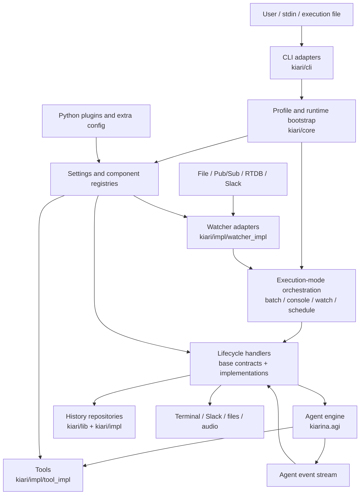
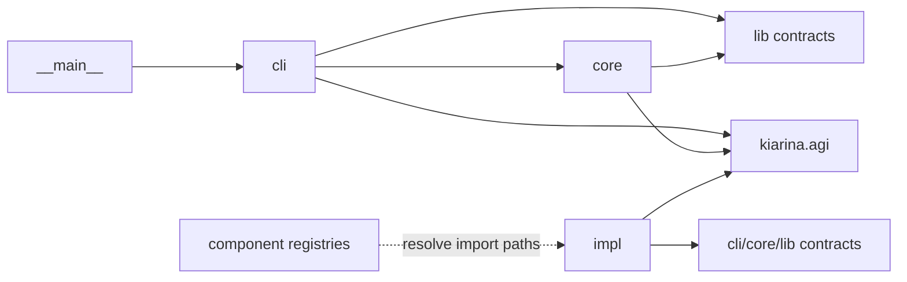
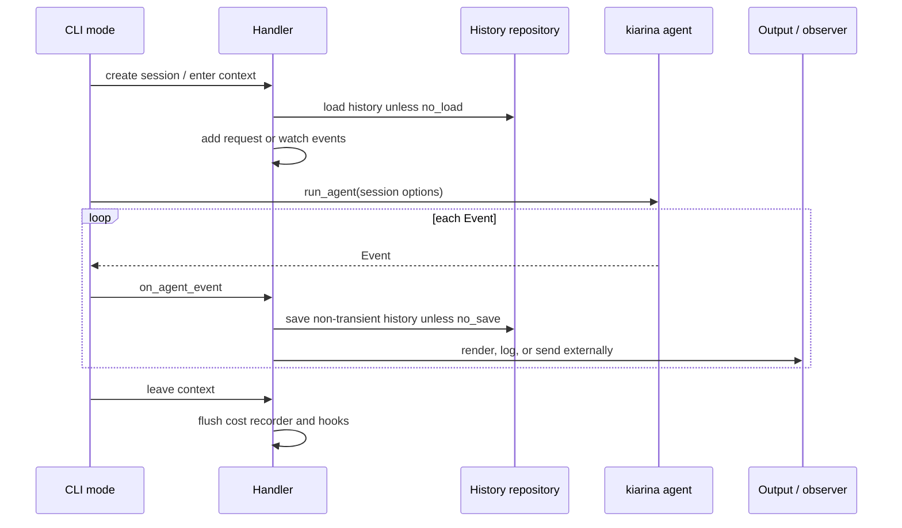

# kiari Architecture

This document is a map for reading the `kiari` codebase. It describes system boundaries,
major data flows, dependency direction, and where to start when making a change. It does
not attempt to enumerate every class or option.

Detailed guidance is split into the following concept documents:

- [Execution Modes](docs/concepts/execution-modes.md): control flow and lifecycle for
  batch, console, watch, and schedule modes
- [Runtime, Configuration, and Extensibility](docs/concepts/runtime-configuration-and-extensibility.md):
  profiles, `RunSpec`, runtime initialization, registries, and plugins
- [Tool Implementation Patterns](docs/concepts/tool-implementation-patterns.md): tool
  structures, selection criteria, and implementation procedure
- [Chrome Tool and Chrome Bridge](docs/concepts/chrome-tool-and-bridge.md): Chrome tool
  sessions, targets, refs, ownership, and real-environment tests

## System Purpose and Boundary

`kiari` is a CLI application for running qualia-oriented LLM agents. The `kiarina`
dependency owns the agent reasoning loop; `kiari` integrates the capabilities around it.

`kiari` is responsible for:

- composing execution settings from CLI input, execution files, and profiles
- configuring `kiarina` chat models, prompts, tools, history, and observability
- providing interactive, one-shot, event-driven, and scheduled execution modes
- providing terminal-side capabilities such as local files, GUI control, and subprocesses
- managing history, costs, logs, and external-service connections
- replacing components through configuration and Python plugins

Model providers, the agent loop, and the base event and message types belong to
`kiarina`. When tracing agent behavior, treat `kiarina.agi.agent.run_agent` and the
related `kiarina.agi.*` modules as an execution engine outside the `kiari` boundary.

## Architectural Overview



The shared pipeline, rather than the CLI command itself, is the center of the system:

1. Separate persisted `RunSpec` data from request-only input.
2. Merge the profile and `RunSpec`, then validate the result as `RunOptions`.
3. Initialize settings, built-in components, extra configuration, plugins, and observers.
4. Create the handler and session for the selected execution mode.
5. Pass the session to `kiarina.agi.agent.run_agent(...)`.
6. Let the handler persist, render, and forward asynchronous events.
7. Flush cost data and release shared resources through finalizers.

## Package Map

### `kiari/cli`: Driving Adapters and Use-Case Orchestration

This package contains CLI entry points and application flow for each execution mode.

- `cli/cli.py`: root dispatch; no arguments select console mode, while non-command input
  selects batch or console mode
- `cli/_helpers/`: CLI normalization, profile composition, and shared shutdown logic
- `cli/batch/`: run one request and exit
- `cli/console/`: interactive input, slash commands, and speech I/O
- `cli/watch/`: enqueue external events and process them with workers
- `cli/schedule/`: combine interval or cron timing with optional watchers
- `cli/ext/`: invoke extension commands registered in the runtime
- `cli/profile/`, `cli/admin/`: manage persistent settings and local data
- `cli/fastapi/`, `cli/streamlit/`: validate startup settings and launch web interfaces

The CLI layer owns use-case ordering. Replaceable behavior remains behind handler
contracts and component registries.

### `kiari/core`: Application-Wide Policies and Bootstrap

This package contains policies and initialization shared across execution modes.

- `core/profile/`: profiles, stored `RunSpec`, and validated `RunOptions`
- `core/app/`: application identity, user-directory policy, and entry-point setup
- `core/runtime/`: settings loading, component registration, and session preparation
- `core/plugin/`: dynamic loading of resolved Python files
- `core/finalizer/`: shared-resource cleanup
- `core/file_resolver/`, `core/file_info_source/`: resolve local and GitHub inputs
- `core/github/`: GitHub retrieval, caching, and trust verification
- `core/paths/`: profile, configuration, history, and cache paths
- `core/logging/`, `core/rich/`, `core/terminal/`: logging and terminal presentation

`core` does not depend on a specific mode's UI.

### `kiari/lib`: Reusable Runtime Capabilities

This package contains contracts and state management reusable across implementations.

- `lib/history_repository/`: history persistence contract and registry
- `lib/watcher/`: external-event normalization and registry
- `lib/web/`: web search and Markdown retrieval contracts
- `lib/subprocess/`: foreground and background subprocess sessions
- `lib/chrome/`: Chrome Bridge settings and client factory
- `lib/gui/`, `lib/keyboard/`, `lib/mouse/`, `lib/monitor/`: desktop control
- `lib/cwd/`, `lib/audio_utils/`: working-directory and audio helpers

Public abstractions in `lib` should not depend on a specific CLI mode.

### `kiari/impl`: Replaceable Implementations

Built-in implementations live under type-specific `*_impl` packages:

- handlers for batch, console, watch, schedule, FastAPI, and Streamlit
- watchers for files, Pub/Sub, Realtime Database, and Slack
- web backends for mock data and kiapi
- history repositories for null, memory, local, GCS, and Firebase Storage
- tools for subprocesses, GUI operations, web access, media generation, and file handling
- chat, cost, and tool loggers
- subprocess and null finalizers

Registries resolve persisted import paths lazily, so callers do not directly select
concrete classes.

### `kiari/resources`, `kiari/fastapi`, and `kiari/streamlit`

- `resources/i18n/`: bundled translation catalogs
- `fastapi/`: ASGI application factory, HTTP schemas, sessions, handlers, and authentication
- `streamlit/`: authentication, user-owned agents, browser console, sessions, and handlers

FastAPI and Streamlit receive a versioned startup payload containing the profile name and
validated `RunOptions`. Worker processes do not rebuild the profile's `RunSpec`.
FastAPI code does not depend on Click, and Streamlit creates a separate `RunContext` and
session for each authenticated browser session and selected agent.

## Dependency Direction



The main rules are:

1. Execution modes resolve handlers, watchers, and repositories through registries.
2. `kiari` assembles a session and delegates the reasoning loop to `kiarina`.
3. External input is normalized into boundary types such as `BatchRequest`,
   `ConsoleRequest`, or `WatchEvent` before reaching handlers.

## Core Runtime Data Model

See [Data Model and History](docs/concepts/kiarina-python/data-model-and-history.md) for
ownership among `kiarina` types, event streams, the `FileInfo` pool, and
hydration/dehydration.

| Data | Role | Main location |
| --- | --- | --- |
| CLI kwargs / execution file | Unvalidated user input | `kiari/cli` |
| `RunSpec` | Persistable execution specification | `kiari/core/profile` |
| `RunOptions` | Pydantic-validated runtime settings | `kiari/core/profile` |
| Request / `WatchEvent` | Request-only text, attachments, and external events | mode package / `kiari/lib/watcher` |
| Session | History, context, AGI options, recorder, and mode state | handler schemas |
| `Event` stream | AI and tool events from the agent engine | `kiarina.agi.event` |
| `History` | Conversation and tool state persisted across iterations | `kiarina.agi.history` + repository |

Request-only values such as batch text, attachments, and stdin are extracted from
`extra_args`; they are not stored in a profile's `RunSpec`.

## Shared Execution Lifecycle



Mode-specific sessions expose `as_run_agent_kwargs()` so every mode can share the same
agent engine and event model. See [Execution Modes](docs/concepts/execution-modes.md).

## Configuration and Extension Model

`RunSpec` and `RunOptions` describe one agent run. Component settings describe default,
preset, and custom implementations. `setup_runtime()` registers built-ins, loads global
and profile configuration, applies CLI and extra configuration, loads i18n and plugins,
and finally configures the `kiarina` context and observers.

Replaceable capabilities follow the pattern:

```text
contract + SettingsManager + ComponentRegistry + implementation
```

See [Runtime, Configuration, and Extensibility](docs/concepts/runtime-configuration-and-extensibility.md).

## Persistence and External State

Persistent and shared state includes:

- the current profile, profile index, and per-profile `RunSpec`
- global and profile component configuration
- agent history through a selected repository
- GitHub cache and trusted-source decisions
- shared subprocess sessions
- per-action Chrome Bridge leases

Paths are centralized under `kiari/core/paths/` and derive from the user directory chosen
by `kiarina.utils.app.user_directory`.

## Concurrency and Cancellation

Major execution modes use `asyncio`:

- batch processes one request sequentially
- console switches between input and agent execution and propagates stop events
- watch separates watcher producer tasks from bounded-queue worker tasks
- schedule owns one long-lived session and runs timer and watcher tasks concurrently
- `graceful_shutdown()` converts SIGINT into stop events

History implementations must account for `watch_max_concurrent` and per-context history
isolation.

## Cross-Cutting Concerns

### Observability

`kiarina.agi` supplies logger and recorder extension points. `setup_runtime()` registers
kiari defaults, `RunOptions` selects implementations, and handlers flush recorders when a
session ends.

### Internationalization

CLI modules register bundled catalogs at import time. Runtime bootstrap loads additional
YAML catalogs. UI changes must update the relevant `_i18n.py`, `resources/i18n/`, and
plugin catalogs together.

### Resource Cleanup

The common CLI `run()` invokes finalizers on success and failure. Chrome actions release
their own exclusive sessions, but kiari does not stop an SDK-managed server or a user's
Chrome process. Every long-lived resource must have an explicit owner and cleanup scope.

### Trust Boundary

Plugins import arbitrary Python into the current process. GitHub file resolution performs
a separate trusted-source check. Changes that bypass remote-input trust or alter plugin
distribution must be reviewed for expansion of the code-execution boundary.

## How to Locate a Change

| Change | Start here | Also inspect |
| --- | --- | --- |
| CLI option or argument | `kiari/cli/*/cli.py`, decorators | `RunOptions`, startup payload, tests |
| Shared agent behavior | `kiari/core/runtime/` | `kiarina.agi`, handler bases |
| One mode's lifecycle | `kiari/cli/<mode>/_operations/` | handler contract and session schema |
| New external event source | `kiari/lib/watcher/` | watcher implementations, watch, schedule |
| New agent tool | `kiari/impl/tool_impl/` | registration and component config |
| New persistence backend | `kiari/lib/history_repository/` | repository implementations and setup |
| New replaceable component | nearest contract/settings/registry | implementation, plugins, tests |
| Profile or config behavior | `kiari/core/profile/`, `kiari/core/runtime/` | paths and CLI common options |
| Terminal rendering | `kiari/core/rich/`, mode renderer | i18n and CLI tests |
| Shared-resource cleanup | `kiari/core/finalizer/` | resource owner |

Schedule is a public API exception: start at `_helpers/run_schedule.py` rather than a
private `_operations/` package.

## Architectural Conventions

- Split packages by feature and internal modules by responsibility.
- Use each package's `__init__.py` as an explicit public façade.
- Separate contracts, settings, registries, and implementations for replaceable behavior.
- Convert external input into Pydantic schemas or typed events early.
- Keep asynchronous acquisition and cleanup inside context managers and `finally`.
- Mirror implementation structure in the test tree where practical.

Follow the nearest existing feature when adding behavior, and expose public APIs
intentionally through `__init__.py`.

## Known Architectural Status

- FastAPI provides an ASGI factory, NDJSON agent endpoint, and replaceable handlers and
  authenticators.
- Streamlit provides a browser chat UI with authentication and user-owned agent sessions.
- The main execution engine lives in `kiarina`; this document does not describe internal
  model iterations or tool dispatch in that dependency.

Update this map and the relevant concept documents in the same change whenever an
execution mode, persistence mechanism, or component family changes.
