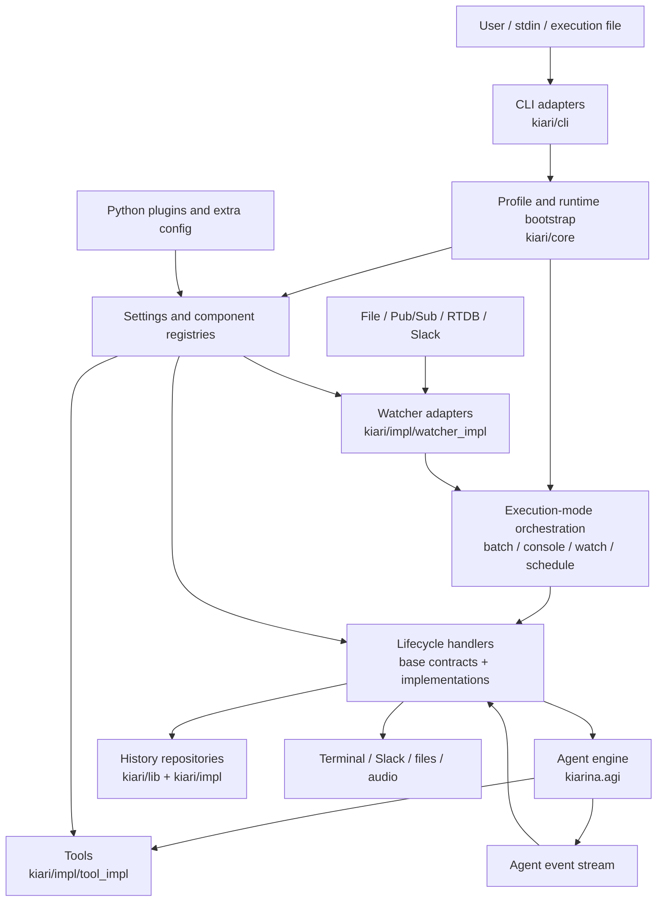
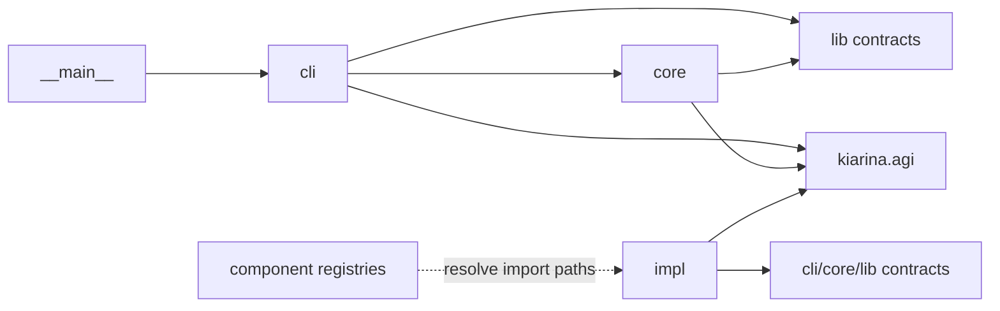
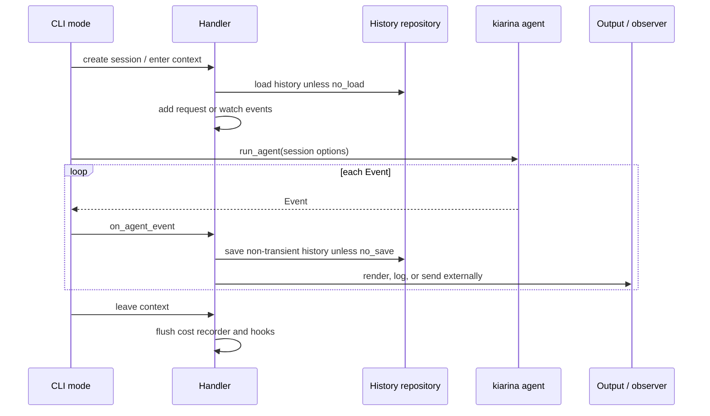

# kiari Architecture

この文書は、`kiari` 全体を読むための地図です。個々のクラスやオプションを網羅するのではなく、システムの境界、主要なデータフロー、依存方向、変更時に読むべき場所を示します。

詳細は次の concept 文書に分離しています。

- [Execution Modes](docs/concepts/execution-modes.md): batch、console、watch、schedule の制御フローとライフサイクル
- [Runtime, Configuration, and Extensibility](docs/concepts/runtime-configuration-and-extensibility.md): Profile、RunSpec、ランタイム初期化、レジストリ、プラグイン
- [Tool Implementation Patterns](docs/concepts/tool-implementation-patterns.md): 単機能型と複数アクション型のツール構成、選択基準、追加手順
- [Chrome Tool and Chrome Bridge](docs/concepts/chrome-tool-and-bridge.md): Chrome tool、SDK session、target/ref、所有権、実環境テスト

## System Purpose and Boundary

`kiari` は、クオリア指向 LLM エージェントを実行するための CLI アプリケーションです。エージェントの推論ループそのものは依存パッケージ `kiarina` が提供し、`kiari` はその周囲を統合します。

`kiari` の主な責務は次のとおりです。

- CLI 入力、実行ファイル、Profile から実行設定を組み立てる
- `kiarina` のチャットモデル、プロンプト、ツール、履歴、観測機構を設定する
- 対話、単発実行、外部イベント監視、定期実行という実行形態を提供する
- ローカルファイル、GUI、サブプロセスなど、端末上で必要なツールを提供する
- 実行履歴、コスト、ログ、外部サービスとの接続を管理する
- 設定と Python プラグインによってコンポーネントを差し替え可能にする

モデルプロバイダー、エージェントループ、イベントやメッセージの基本型は `kiarina` 側の責務です。したがって、エージェントの振る舞いを追うときは `kiari` のハンドラーだけでなく、`kiarina.agi.agent.run_agent` と関連する `kiarina.agi.*` も境界の外側にある実行エンジンとして扱います。

## Architectural Overview

中心にあるのは「CLI コマンド」ではなく、次の共通パイプラインです。

1. 入力を `RunSpec` と、その実行だけで使う入力に分ける。
2. Profile の保存値と `RunSpec` を合成し、`RunOptions` として検証する。
3. 設定、組み込みコンポーネント、追加設定、プラグイン、観測機構を初期化する。
4. 実行モード固有の Handler と Session を作る。
5. Session を `kiarina.agi.agent.run_agent(...)` に渡す。
6. 非同期に返る Event を Handler が保存・表示・外部送信する。
7. コストを flush し、子プロセスなどの共有リソースを finalizer で終了する。

## Package Map

### `kiari/cli`: Driving Adapters and Use-Case Orchestration

CLI の入口と、各実行モードのアプリケーションフローを持ちます。

- `cli/cli.py`: ルートコマンド。引数がなければ console、先頭が既知コマンドでなければ入力に応じて batch または console に振り分ける
- `cli/_helpers/`: CLI 引数の正規化、Profile の合成、共通の終了処理
- `cli/batch/`: 1 リクエストを実行して終了するモード
- `cli/console/`: 対話、slash command、音声入出力を扱うモード
- `cli/watch/`: 外部イベントをキューに入れ、複数 worker で処理するモード
- `cli/schedule/`: interval/cron と任意の watcher を組み合わせるモード
- `cli/ext/`: ランタイム内で登録済みの拡張コマンドを実行する入口
- `cli/profile/`, `cli/admin/`: 永続設定とローカルデータを管理する運用コマンド
- `cli/fastapi/`: Profile と CLI から確定した RunOptions を startup payload に固定し、uvicorn を起動する interface
- `cli/streamlit/`: Profile と CLI で確定した RunOptions を startup payload に固定し、Streamlit server を起動する interface

`cli` は入出力層であると同時に、ユースケースの順序を決める層です。ただし、差し替え可能な振る舞いは各 `Base*Handler` のテンプレートメソッドに閉じ込められています。

### `kiari/core`: Application-Wide Policies and Bootstrap

複数の実行モードが共有する方針と初期化を持ちます。

- `core/profile/`: Profile、保存済み RunSpec、検証済み `RunOptions`
- `core/runtime/`: 設定ロード、組み込みツール登録、`kiarina` の各種 option 作成、履歴の開始・再開
- `core/plugin/`: 解決済み Python ファイルを動的 module としてロード
- `core/finalizer/`: 実行終了時の共有リソース解放
- `core/file_resolver/`, `core/file_info_source/`: ローカルや GitHub などの指定から入力ファイルを解決
- `core/github/`: GitHub ファイル取得、キャッシュ、信頼元の検証
- `core/paths/`: ユーザーデータ内の Profile、設定、履歴、キャッシュのパス
- `core/logging/`, `core/rich/`, `core/terminal/`: ログ、表示、端末制御

`core` は特定モードの UI を知りません。モード間で共有されるブートストラップとポリシーを置く場所です。

### `kiari/lib`: Reusable Runtime Capabilities

アプリケーション固有の実装から再利用できる抽象と状態管理を提供します。

- `lib/history_repository/`: 履歴保存の契約と registry
- `lib/watcher/`: 外部イベントを `WatchEvent` に正規化する契約と registry
- `lib/web/`: Web 検索と Markdown 取得の契約、結果型、registry
- `lib/subprocess/`: foreground/background subprocess の session 管理
- `lib/chrome/`: Chrome Bridge SDK の接続設定と client factory
- `lib/gui/`, `lib/keyboard/`, `lib/mouse/`, `lib/monitor/`: デスクトップ操作の基盤
- `lib/cwd/`, `lib/audio_utils/`: 作業ディレクトリと音声再生の補助

`lib` の公開抽象は、原則として特定の CLI モードに依存しません。アプリケーション横断で再利用する能力をここに置きます。

### `kiari/impl`: Replaceable Implementations

抽象の組み込み実装を、種類ごとの `*_impl` 以下に置きます。

- Handler: batch、console、watch、schedule、FastAPI、Streamlit の標準実装
- Watcher: file、Pub/Sub、Realtime Database、Slack
- Web: mock、kiapi
- HistoryRepository: null、in-memory、local
- Tool: subprocess、GUI、Web 検索・取得、画像・動画生成、各種ファイル表示・編集、作業ディレクトリ変更
- Logger: chat、cost、tool
- Finalizer: subprocess、null

設定に保持された import path を registry が遅延解決するため、呼び出し側は具体クラスを直接選びません。`impl` から `cli` の Handler 契約を参照する箇所はありますが、実行モードの operation は registry を通して実装を取得します。

### `kiari/resources`, `kiari/fastapi`, and `kiari/streamlit`

- `resources/i18n/`: package 内蔵の翻訳カタログ
- `fastapi/`: 独立した ASGI project。application factory、HTTP schema、Session、FastAPIHandler、Authenticator を持つ
- `streamlit/`: 独立した Streamlit project。認証、ユーザー所有の agent 管理、GUI console、Session、StreamlitHandler を持つ

`kiari/cli/fastapi` は HTTP や agent lifecycle を所有せず、`kiari/fastapi` は Click や
CLIArgs を参照しません。reload / worker process には、CLI で検証済みの Profile 名と
RunOptions を version 付き JSON payload として渡します。worker は Profile RunSpec を再合成せず、
lifespan 内で component config と runtime を初期化します。

Streamlit も同じ startup payload 境界を使います。app process は runtime を一度だけ初期化し、
ブラウザ session ごとに認証 identity と選択された agent ID から RunContext と Session を作ります。
CLI package は Streamlit widget、認証、History lifecycle を参照しません。

## Dependency Direction

実装上の依存方向は、概ね次のように読むことができます。

重要なルールは次の 3 点です。

1. 実行モードは具体実装を直接生成せず、registry から Handler、Watcher、Repository などを解決する。
2. `kiari` は Session を組み立てて `kiarina` の agent engine に渡し、返された Event を処理する。推論ループを複製しない。
3. 外部入力は Handler に直接流し込まず、`BatchRequest`、`ConsoleRequest`、`WatchEvent` などの境界型へ正規化する。

## Core Runtime Data Model

kiarina 側の型同士の所有関係、Event stream、FileInfo pool、hydrate / dehydrate の詳細は
[Data Model and History](docs/concepts/kiarina-python/data-model-and-history.md) を参照してください。

主要なデータは次の順に形を変えます。

| Data | Role | Main location |
| --- | --- | --- |
| CLI kwargs / execution file | 未検証のユーザー入力 | `kiari/cli` |
| `RunSpec` | Profile に保存できる辞書形式の実行指定 | `kiari/core/profile` |
| `RunOptions` | Pydantic で検証済みの実行設定 | `kiari/core/profile` |
| Request / `WatchEvent` | その実行だけのテキスト、添付、外部イベント | 各 mode、`kiari/lib/watcher` |
| Session | History、RunContext、AGI options、cost recorder、mode state の集合 | 各 Handler の `_schemas` |
| `Event` stream | agent engine が生成する AI、tool などのイベント | `kiarina.agi.event` |
| `History` | 次の iteration と次の実行へ引き継ぐ会話・tool 状態 | `kiarina.agi.history` + repository |

`RunSpec` と Request を分離することが重要です。たとえば batch の `texts`、`attachments`、stdin 本文は `extra_args` に抜き出され、Profile の RunSpec には保存されません。

## Shared Execution Lifecycle

各モードには違いがありますが、Handler のライフサイクルは共通しています。

Session はモード固有の状態を持ちますが、`as_run_agent_kwargs()` によって agent engine が必要とする入力へ変換されます。これにより、batch、console、watch、schedule が同じ engine と event model を共有します。

モードごとの違いは [Execution Modes](docs/concepts/execution-modes.md) を参照してください。

## Configuration and Extension Model

kiari には、目的の異なる 2 種類の設定があります。

- `RunSpec` / `RunOptions`: 今回の agent 実行をどう行うか。Profile に保存できる
- component settings: registry の default、preset、custom import path や実装固有設定をどう構成するか

起動時の `setup_runtime()` は、組み込みツールと logger の preset を登録した後、global config、Profile config、CLI の config vars、追加 config、i18n、plugin を順番にロードし、最後に `kiarina` の RunContext と観測機構を設定します。

`image_generate` と `video_predict` も既存の Tool registry に登録される組み込み実装です。新しい component family や kiari 固有のモデル設定は持たず、画像・動画モデルと provider の選択は、それぞれ `kiarina.agi.image_generation_model` と `kiarina.agi.video_generation_model` の component settings に従います。Web 検索と Markdown 取得は `kiari.lib.web` の独立した component family として、mock または kiapi 実装を registry から解決します。

拡張の基本単位は「契約 + SettingsManager + ComponentRegistry + 実装」です。Plugin は Python ファイルを import することで、その import 時の設定変更や登録処理を既存 registry に反映できます。

詳細な合成順序と拡張手順は [Runtime, Configuration, and Extensibility](docs/concepts/runtime-configuration-and-extensibility.md) を参照してください。

## Persistence and External State

永続状態は大きく次の領域に分かれます。

- Profile index: 現在の Profile と Profile 一覧
- Profile RunSpec: Profile ごとの既定の実行オプション
- global/Profile config: component settings と `kiarina` を含む設定
- History repository: agent の History。既定は `null` で、`local` または `in_memory` に差し替え可能
- GitHub cache と trusted sources: リモートファイル解決のキャッシュと信頼判断
- subprocess sessions: プロセス内で共有され、finalizer が終了時に解放する状態
- Chrome Bridge session: `chrome` tool の各 action が取得し、その action の終了時に解放する lease

具体的なファイルパスは `kiari/core/paths/` に集約され、`kiarina.utils.app.user_directory` が決めるユーザーデータディレクトリを基準にします。コード中にユーザーデータの絶対パスを直接埋め込まない構造です。

## Concurrency and Cancellation

すべての主要実行モードは `asyncio` 上で動きます。

- batch は単一 request を逐次処理する
- console は入力と agent 実行を状態機械で切り替え、Enter による停止イベントを agent や音声入力へ渡す
- watch は watcher ごとの producer task と、上限付き queue を読む worker task を分離する
- schedule は 1 つの長寿命 Session を持ち、timer loop と watcher task を並行実行する
- SIGINT による終了要求は `graceful_shutdown()` が stop event に変換し、watcher や schedule loop に伝播する

共有履歴を扱う実装を追加するときは、watch の `watch_max_concurrent` による並行実行と、RunContext ごとの履歴分離を考慮する必要があります。

## Cross-Cutting Concerns

### Observability

request、cost、chat、tool の logger/recorder は `kiarina.agi` の拡張点を使います。`setup_runtime()` が kiari 固有の既定 logger を preset に追加し、`RunOptions` が今回使う実装を選びます。Handler は各 Session の終了時に cost recorder を flush します。

### Internationalization

package 内蔵カタログは CLI module の import 時に登録され、追加の YAML catalog は runtime bootstrap 中にロードされます。UI 文言を追加するときは、対応する `_i18n.py` と `resources/i18n/`、必要なら plugin の追加 catalog を同じ境界として確認します。

### Resource Cleanup

CLI の共通 `run()` は成功・失敗にかかわらず finalizer を実行します。既定では subprocess の終了処理が選ばれています。Chrome Bridge の exclusive session は `chrome` tool の action 内の context manager が解放し、SDK が起動した共有 managed server やユーザーの Chrome は finalizer で終了しません。長寿命またはプロセス外リソースを持つ機能は、開始した scope、Handler の finally hook、Finalizer のどれが所有するかを明確にする必要があります。

### Trust Boundary

Plugin は任意の Python コードを現在のプロセスへ import します。また、GitHub 上のファイル解決には trusted source の検証があります。この 2 つは同じものではありません。リモート入力の信頼確認を無効化するオプションや plugin 配布元を扱う変更では、コード実行境界が広がらないかを確認してください。

## How to Locate a Change

| Change | Start here | Also inspect |
| --- | --- | --- |
| CLI option or argument | `kiari/cli/*/cli.py`, decorators | `RunOptions`, bootstrap message, tests |
| Agent execution behavior shared by modes | `kiari/core/runtime/` | `kiarina.agi`, all Handler base classes |
| One mode's lifecycle | `kiari/cli/<mode>/_operations/`（schedule は公開 API のため `_helpers/run_schedule.py`） | Handler contract, Session schema, implementation |
| New external event source | `kiari/lib/watcher/` | `kiari/impl/watcher_impl/`, watch and schedule |
| New agent tool | `kiari/impl/tool_impl/` | `_register_tools()` or custom registry config |
| New persistence backend | `kiari/lib/history_repository/` | `kiari/impl/history_repository_impl/`, history setup |
| New replaceable component | nearest contract/settings/registry trio | `impl/`, plugin config, mirrored tests |
| Profile or config behavior | `kiari/core/profile/`, `kiari/core/runtime/` | `kiari/core/paths/`, CLI common options |
| Terminal rendering | `kiari/core/rich/`, mode renderer | i18n catalog and snapshot-style CLI tests |
| Cleanup of a shared resource | `kiari/core/finalizer/` | resource owner in `kiari/lib/` or `kiari/impl/` |

## Architectural Conventions

- Feature ごとに package を切り、その内部を `_models`、`_schemas`、`_services`、`_operations`、`_helpers`、`_types`、`_utils` などの責務で分ける。
- package の `__init__.py` は、その feature の公開 API を明示する façade として使う。
- 差し替え可能な機能は、Protocol/基底クラス、settings、registry、具体実装を分離する。
- 外部入力は Pydantic schema または型付きイベントへ早い段階で変換する。
- 非同期リソースの開始・終了は context manager と `finally` に閉じ込める。
- テストツリーは原則として実装ツリーをミラーし、変更対象の責務とテストの位置を一致させる。

新しい機能を追加するときは、既存の最も近い feature の構造を踏襲し、公開 API を `__init__.py` から意図的に公開してください。

## Known Architectural Status

- FastAPI は ASGI application factory、NDJSON agent endpoint、差し替え可能な Handler / Authenticator を持ちます。
- Streamlit の CLI は公開コマンドとして存在しますが、現在は `Not implemented yet` を表示するだけです。
- 実行エンジンの主要部分は外部依存 `kiarina` にあります。`kiari` 単体の図だけで agent 内部の iteration、model call、tool dispatch の詳細までは表現していません。

この文書は現行実装を説明するものです。新しい実行モード、永続化方式、または component family を追加した場合は、コードと同じ変更でこの地図と該当 concept 文書を更新してください。
