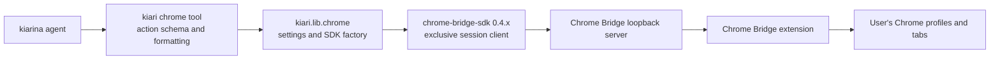
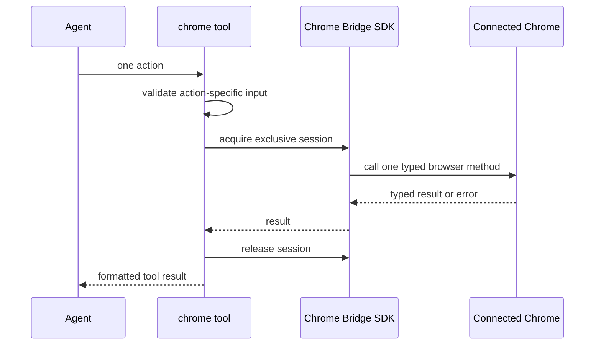

# Chrome Tool and Chrome Bridge

この文書は、組み込み `chrome` tool と Chrome Bridge SDK の境界、状態とリソースの所有権、
実装・運用・更新時に注意する挙動を説明します。Chrome Bridge 自体の API リファレンスを複製する
ものではなく、kiari から利用するときの正典です。

ツール一般の構成は [Tool Implementation Patterns](tool-implementation-patterns.md)、設定の合成順序は
[Runtime, Configuration, and Extensibility](runtime-configuration-and-extensibility.md) を参照してください。

## Components and Responsibility Boundary



各 component の責務は次のとおりです。

| Component | Responsibility |
| --- | --- |
| `kiari/impl/tool_impl/chrome` | 24 action の公開 schema、action 固有の入力検証、SDK method への dispatch、tool 用の結果整形 |
| `kiari/lib/chrome` | 接続設定と `ChromeBridge` factory |
| Chrome Bridge SDK | managed server の再利用または起動、exclusive session、typed request/result、Bridge error |
| Chrome Bridge server/extension | 接続中の Chrome instance、target tab、accessibility snapshot、Chrome 操作 |
| Chrome | ユーザーが所有する process、profile、tab、download などのブラウザー状態 |

kiari は Chrome Bridge の wire protocol や Chrome automation を独自実装しません。SDK の typed method を
一度呼び出す adapter に留め、SDK/server/extension の契約をそのまま利用します。

## Public Tool Actions

`chrome` は同じ browser state を扱う操作を 1 tool にまとめた複数アクション型です。

| Area | Actions | Notes |
| --- | --- | --- |
| Browser discovery | `instances`, `tabs` | 複数 instance がある場合は、以後の action に `browser_id` が必要 |
| Tab lifecycle | `tab_open`, `tab_close`, `tab_select`, `tab_activate` | `tab_select` と `tab_activate` は異なる |
| Page state | `snapshot`, `screenshot`, `console_logs` | element action の前に `snapshot` で strict ref を得る |
| Browser dialog | `dialog_respond` | dialog PageState の厳密な ref へ `accept` または `dismiss` を返す |
| Element operation | `click`, `hover`, `drag`, `upload_file`, `type`, `select_option` | element description と最新 snapshot の ref を組で渡す |
| Keyboard/navigation | `press_key`, `navigate`, `go_back`, `go_forward` | target tab に対して実行する |
| Synchronization | `wait`, `wait_for` | 固定待機より、観測可能な text を待つ `wait_for` を優先する |
| Artifacts | `download_file`, `record_video` | Chrome Bridge が実行し、結果 metadata を返す |

SDK と同じ snake_case の引数名を使います。主な既定値も SDK 0.4 に合わせています。

- `tab_open`: `url="about:blank"`, `active=true`
- `type`: `submit=false`
- `wait_for`: `state="visible"`, `timeout=10`
- `download_file`: `timeout=10`

共通 schema は全 action の入力を合わせた形なので、action 固有の必須値は operation 内で検証します。
`type.text` は未指定の `None` と明示された空文字列を区別し、空文字列による入力内容の消去を許可します。
SDK の `browser_dialog_respond(..., action=...)` は tool の action discriminator と名前が衝突するため、
tool schema では応答値を `dialog_action` として公開し、operation 境界で SDK の `action` へ渡します。

## Browser Dialog PageState

SDK 0.4 では page state は通常の accessibility `Snapshot` または browser-native dialog を表す
`BrowserDialogSnapshot` です。`alert`、`confirm`、`prompt`、`beforeunload` が開くと document input と
accessibility inspection は遮断され、それまでの element ref はすべて無効になります。

Chrome tool は dialog type、message、default prompt、actions と厳密な `dialog_ref` を本文へ返します。
応答には `dialog_respond` を使い、直前の dialog state にある ref と `dialog_action="accept"` または
`"dismiss"` を渡します。prompt を accept するときだけ `prompt_text` を指定できます。
`beforeunload` では accept はページを離れ、dismiss は現在のページに留まる意味です。

応答結果も fresh PageState です。再開した JavaScript が次の dialog を開いた場合は新しい ref で
再度応答します。録画付き操作や download が dialog で中断された場合、応答後の document snapshot に
完了した recording / download metadata が付随するため、Chrome tool は accessibility attachment と
一緒にその metadata も返します。

## Session and Lease Lifecycle

各 tool action は、入力検証後に新しい exclusive session を取得し、SDK method を 1 回だけ呼び、
context exit で lease を解放します。



複数 action の間では lease を保持しません。この方針には次の性質があります。

- 長い agent iteration の間、Chrome を kiari が占有し続けない。
- 成功、SDK error、tool cancellation のどの経路でも action scope で lease を解放できる。
- 別 client が action 間で target tab、document、snapshot generation を変更できる。
- 複数 action を 1 transaction として扱うことはできない。次の action は現在状態を再観測して行う。

session acquire の待機時間は `session_wait_timeout` で制御します。`None` は SDK の deadline なしの
規則を使います。kiari は action を内部で自動再試行しません。

## Target Tab, Active Tab, and Page Readiness

Chrome Bridge では「操作対象」と「ユーザーに表示されている active tab」を分けて扱います。

- `tab_select` は Chrome Bridge の target tab を選ぶ。通常、Chrome の foreground tab は変えない。
- `tab_activate` は tab を active にし、ユーザーが見ている Chrome UI を変更する。
- page action は active tab ではなく、選択された target tab に対して実行される。

バックグラウンド操作では、`tab_open(active=false)` の後に `tab_select` を使います。既存の active tab を
保持したい処理で `tab_activate` を代用してはいけません。

SDK 0.4 では target がない状態の `tab_open` は新しい tab を target にし、`navigate` は inactive な
target tab を作ってから遷移します。どちらもユーザーの既存 active tab を foreground にしません。

`tab_open` は navigation の完了を待たずに返ることがあります。実環境では、返された `Tab.url` が
一時的に空文字列になることを確認しています。open 結果の URL だけを readiness 判定に使わず、
次のいずれかで同期します。

1. fixture や対象ページに確実に現れる text を `wait_for` する。
2. `snapshot` の URL、title、accessibility tree を確認する。
3. timeout 後に同じ mutation を再送せず、現在の tabs/snapshot を再観測する。

## Snapshot and Strict Refs

element operation の `ref` は単なる selector ではありません。browser instance、target tab、document、
snapshot generation に結び付いた strict ref です。navigation、DOM mutation、新しい snapshot、別 client の
操作などにより stale になる可能性があります。

基本フローは次のとおりです。

1. 必要なら `instances` と `tabs` で browser/tab を特定する。
2. `tab_select` で target を決める。
3. `snapshot` または snapshot を返す operation で現在の accessibility tree を得る。
4. tree にある人間可読な element description と ref を組にして action を呼ぶ。
5. page state が変わったら、返された新しい snapshot を使うか `snapshot` を取り直す。

stale ref error を受けた場合、古い ref で同じ action を繰り返さず、まず snapshot を取り直します。
action ごとに session が分かれるため、直前に得た ref でも別 client の介入によって失効し得ます。

## Result Formatting

SDK の typed result は、agent が次の判断に使いやすい形へ変換します。

| Result | Tool output |
| --- | --- |
| Snapshot | URL、title、generation、任意の browser ID を本文に、accessibility tree を text `FileInfo` に分離 |
| Browser dialog | URL、title、generation、dialog type/message/default prompt、厳密な dialog ref、選択可能な action |
| Instance、tab、close、download、recording など | snake_case JSON |
| Console entries | 1 entry 1 行の JSON。entry がなければ短い説明文 |
| Key press、fixed wait | 短い結果テキスト |
| `RecordedResult` | operation の結果と recording metadata の両方 |
| Screenshot | dimensions/MIME のテキストと、`create_file()` で作った PNG `FileInfo` を持つ `Content` |

JSON は SDK dataclass を `asdict()` で変換するため、tool API では snake_case を保ちます。screenshot の
base64 data を長いテキストとしてモデルへ返さず、kiarina の file attachment として扱います。

snapshot の accessibility tree は `chrome-snapshot:<browser_id>`（browser ID が得られない場合は
`chrome-snapshot:default`）を `unique_key` に持つ text `FileInfo` として返します。click、navigate、
wait_for などが返す snapshot、録画付き結果、download 結果内の snapshot も同じ形式です。これにより
agent の `pre_run()` では browser ごとに最新の snapshot だけが file pool に残ります。Chrome Bridge の
target tab は browser ごとに 1 つなので、target が切り替わった場合も古い strict ref を含む snapshot は
置き換えられます。

## Error Semantics

`ChromeBridgeError` は `ToolError` へ変換し、元の説明に次の metadata を残します。

- `code`: machine-readable な失敗種別
- `retryable`: SDK が再試行可能と分類したか
- `outcome_unknown`: request の副作用が発生したか確定できないか

`retryable=true` は kiari が自動で再送するという意味ではありません。agent または呼び出し側が、現在状態を
観測したうえで再試行の可否を判断するための情報です。特に `outcome_unknown=true` の mutation は、同じ操作を
即座に再送すると click、download、入力などを二重実行する危険があります。tabs、snapshot、download 状態などを
先に確認します。

`asyncio.CancelledError` は Chrome Bridge error として包まず、tool runner の cancellation 契約へ伝播させます。
session context manager は cancellation や例外でも lease を解放します。

## Configuration

`ChromeSettings` は SDK 0.4 の既定値に揃えています。通常の SettingsManager config と
`KIARI_CHROME_*` environment variable の双方から上書きできます。

| Field | Environment variable | Default | Meaning |
| --- | --- | --- | --- |
| `host` | `KIARI_CHROME_HOST` | `127.0.0.1` | loopback host。`127.0.0.1`、`localhost`、`::1` のみ |
| `port` | `KIARI_CHROME_PORT` | `8765` | Chrome Bridge Direct API port |
| `startup_timeout` | `KIARI_CHROME_STARTUP_TIMEOUT` | `45` | managed server と extension を待つ秒数 |
| `session_idle_ttl` | `KIARI_CHROME_SESSION_IDLE_TTL` | `120` | exclusive session の server-side idle lifetime |
| `session_max_lifetime` | `KIARI_CHROME_SESSION_MAX_LIFETIME` | `600` | exclusive session の最大 lifetime |
| `session_wait_timeout` | `KIARI_CHROME_SESSION_WAIT_TIMEOUT` | `None` | exclusive session acquire の待機上限 |

host は loopback に限定します。Chrome Bridge を外部 interface へ公開するための設定ではありません。

## Resource Ownership and Cleanup

所有権を誤ると、ユーザーが普段使っている Chrome を終了したり、別 client の server を停止したりします。
kiari の境界は次のとおりです。

| Resource | Owner | kiari cleanup |
| --- | --- | --- |
| One action's exclusive session | `chrome` operation | `async with` の exit で必ず release |
| SDK managed server | Chrome Bridge SDK/runtime | 停止しない |
| Chrome process/profile | User | 起動・kill・専用 user-data-dir 管理をしない |
| Existing tabs | User | 自動で閉じない |
| Tool/test が明示的に開いた tab | Opening scope | tab ID を保持し、同じ browser ID で `finally` cleanup |
| subprocess sessions | kiari subprocess capability | subprocess finalizer が cleanup |

このため Chrome finalizer は存在せず、既定 finalizer は subprocess のみです。Chrome tool の利用終了時に
managed server や Chrome process を止める処理を追加してはいけません。

download と recording はユーザー環境へ artifact を作る副作用があります。出力名は SDK が受け入れる safe な
filename を使い、再試行時は `outcome_unknown` と既存 artifact を考慮します。

## Real-Environment Integration Test

Chrome Bridge の更新による SDK/server/extension 間の退行は、session や typed method を mock すると検出できません。
この境界のテストは mock を使わず、`costly` marker 付きで実 SDK と接続中の extension を通します。

前提環境:

- `chrome-bridge-sdk` と互換な Chrome Bridge 0.4.x extension が Chrome に導入済み
- extension が SDK の loopback server へ接続可能
- Chrome を操作できるローカル desktop session

実行方法:

```sh
make chrome_test
# equivalent to:
mise run test --costly --path tests/impl/tool_impl/chrome
```

通常の `mise run test` と `mise run ci` では costly test を skip します。明示実行される integration test は
loopback HTTP fixture を起動し、次を確認します。

- 公開 Action と dispatch table の 24 action が一致する。
- 実 SDK session で instance と tab を取得できる。
- test 所有の非 active tab を開き、target に選んでも既存 active tab が変わらない。
- target を閉じた後、`tab_open` と `navigate` が inactive target を自動作成できる。
- `wait_for` で navigation 完了を待ち、snapshot の strict ref で click できる。
- click で開いた confirm dialog を dominant PageState として受け取り、厳密な dialog ref で応答できる。
- console log と screenshot attachment が tool 境界で正しく整形される。
- 正常終了と失敗時 cleanup の双方で、test が開いた tab だけを閉じる。

test は既存 tab を閉じたり、既存 active tab を変更したままにしてはいけません。新しい操作を integration test に
加えるときは、download/recording/upload などの host 側副作用と、その確実な cleanup 方法を先に定義します。

## SDK or Extension Update Checklist

Chrome Bridge または SDK を更新するときは、次の順で確認します。

1. `pyproject.toml` の互換 version range と `uv.lock` を更新する。
2. tool action と SDK typed method の名前、引数、既定値、result dataclass を照合する。
3. error の `code`、`retryable`、`outcome_unknown` 契約を確認する。
4. 対応 extension を接続した環境で `make chrome_test` を実行する。
5. `mise run ci` で通常テスト、lint、mypy、package build を確認する。
6. ownership が変わっていないこと、特に Chrome process と managed server を kiari が終了しないことを確認する。

SDK の新機能を公開するときは、action/schema/operation/formatting を同時に更新します。SDK 内部 API や raw wire
payload へ依存せず、公開 typed method と result type を adapter 境界に保ちます。
