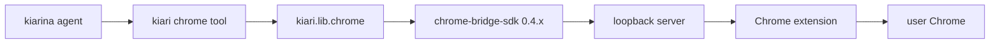
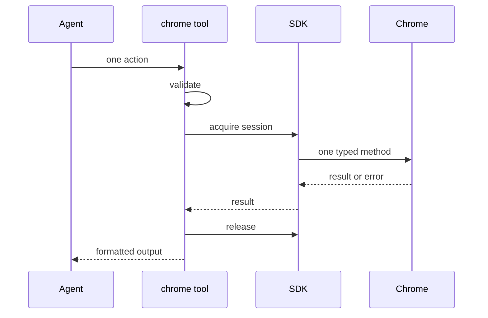

# Chrome Tool and Chrome Bridge

This document is the canonical kiari-side contract for the built-in `chrome` tool. It
covers the SDK boundary, state, ownership, errors, and integration testing without
duplicating the Chrome Bridge API reference.

See [Tool Implementation Patterns](tool-implementation-patterns.md) and
[Runtime, Configuration, and Extensibility](runtime-configuration-and-extensibility.md).

## Components and Responsibilities



| Component | Responsibility |
| --- | --- |
| Chrome tool | Public actions, validation, SDK dispatch, and tool-result formatting |
| `kiari.lib.chrome` | Connection settings and SDK factory |
| SDK | Managed-server lifecycle, exclusive sessions, typed requests/results, errors |
| Server and extension | Browser instances, target tabs, snapshots, and operations |
| Chrome | User-owned processes, profiles, tabs, downloads, and recordings |

kiari calls public typed SDK methods and does not implement the wire protocol or browser
automation itself.

## Public Actions

| Area | Actions |
| --- | --- |
| Discovery | `instances`, `tabs` |
| Tabs | `tab_open`, `tab_close`, `tab_select`, `tab_activate` |
| Page state | `snapshot`, `screenshot`, `console_logs` |
| Dialogs | `dialog_respond` |
| Elements | `click`, `hover`, `drag`, `upload_file`, `type`, `select_option` |
| Navigation | `press_key`, `navigate`, `go_back`, `go_forward` |
| Synchronization | `wait`, `wait_for` |
| Artifacts | `download_file`, `record_video` |

Use `browser_id` when multiple instances exist. Prefer `wait_for` over fixed waits.
Arguments follow SDK snake_case. Notable defaults are `tab_open(active=true)`,
`type(submit=false)`, `wait_for(state="visible", timeout=10)`, and
`download_file(timeout=10)`.

Action-specific required fields are validated inside operations. `type.text` distinguishes
`None` from an explicit empty string, allowing content to be cleared. The tool exposes
the dialog response as `dialog_action` to avoid colliding with the tool's action
discriminator.

## Dialog Page State

A browser-native alert, confirm, prompt, or beforeunload dialog replaces the normal
accessibility snapshot and invalidates existing element refs.

The tool returns dialog type, message, default prompt, allowed actions, and a strict
`dialog_ref`. Respond with the latest ref and `dialog_action="accept"` or
`"dismiss"`. Supply `prompt_text` only when accepting a prompt. For beforeunload,
accept means leave and dismiss means stay.

A response returns fresh page state. If JavaScript opens another dialog, respond again
with its new ref. Recording or download metadata that completes after the dialog is
included with the resulting page state.

## Session and Lease Lifecycle

Each action validates input, acquires a new exclusive session, calls one typed SDK method,
and releases the lease on context exit.



Leases are not retained across actions. Other clients may change targets or documents
between calls, so every action must work from current state. `session_wait_timeout`
controls acquisition. kiari does not automatically retry actions.

## Target and Active Tabs

`tab_select` changes the Chrome Bridge target without normally changing the user's
foreground tab. `tab_activate` changes the visible Chrome UI. Page actions operate on the
target, not necessarily the active tab.

For background work, open with `active=false` and select the new tab. Never substitute
activation when the active tab must remain unchanged.

Opening or navigating may return before page readiness and may briefly report an empty
URL. Synchronize by waiting for known text or inspecting a fresh snapshot. After a timeout,
observe current state before repeating a mutation.

## Snapshots and Strict Refs

A ref belongs to one browser, target tab, document, and snapshot generation. Navigation,
DOM mutation, a newer snapshot, or another client can make it stale.

1. Discover instances and tabs if needed.
2. Select a target.
3. Obtain a snapshot.
4. Pair a human-readable element description with its ref.
5. After page changes, use the returned fresh snapshot or request another.

On a stale-ref error, refresh the snapshot before deciding whether to retry.

## Result Formatting

| Result | Tool output |
| --- | --- |
| Snapshot | URL, title, generation, browser ID, plus accessibility tree as text `FileInfo` |
| Dialog | Page metadata, dialog fields, strict ref, and allowed actions |
| Instances, tabs, downloads, recordings | snake_case JSON |
| Console entries | One JSON object per line |
| Key press and fixed wait | Short text |
| Recorded result | Operation result plus recording metadata |
| Screenshot | Dimension/MIME text plus PNG `FileInfo` |

Snapshots use `chrome-snapshot:<browser_id>` as `unique_key`, or
`chrome-snapshot:default`. Agent pre-run processing therefore retains only the newest
snapshot per browser. Screenshot bytes are attachments, not long base64 text.

## Error Semantics

`ChromeBridgeError` becomes `ToolError` while preserving:

- `code`: machine-readable category
- `retryable`: SDK classification
- `outcome_unknown`: whether a mutation may already have occurred

Retryable does not mean automatically retried. When outcome is unknown, observe tabs,
snapshots, downloads, or recordings before resending a mutation. Cancellation propagates
as `asyncio.CancelledError`; context exit still releases the lease.

## Configuration

| Field | Environment variable | Default |
| --- | --- | --- |
| `host` | `KIARI_CHROME_HOST` | `127.0.0.1` |
| `port` | `KIARI_CHROME_PORT` | `8765` |
| `startup_timeout` | `KIARI_CHROME_STARTUP_TIMEOUT` | `45` |
| `session_idle_ttl` | `KIARI_CHROME_SESSION_IDLE_TTL` | `120` |
| `session_max_lifetime` | `KIARI_CHROME_SESSION_MAX_LIFETIME` | `600` |
| `session_wait_timeout` | `KIARI_CHROME_SESSION_WAIT_TIMEOUT` | `None` |

The host is restricted to loopback values. These settings do not expose Chrome Bridge to
an external interface.

## Ownership and Cleanup

| Resource | Owner | kiari behavior |
| --- | --- | --- |
| One action's exclusive session | operation | Always release on context exit |
| SDK-managed server | SDK/runtime | Do not stop |
| Chrome process and profile | user | Do not start, kill, or manage |
| Existing tabs | user | Do not close |
| Tab opened by a tool or test | opening scope | Close by exact browser and tab ID in `finally` |
| Subprocess sessions | kiari subprocess capability | Clean through subprocess finalizer |

There is no Chrome finalizer. Downloads and recordings create user-environment artifacts;
use safe filenames and account for existing artifacts before retrying.

## Real-Environment Integration Test

Mocks cannot detect compatibility regressions among the SDK, server, and extension. Run
the costly integration test with a compatible 0.4.x extension connected to local Chrome:

```sh
make chrome_test
# equivalent to:
mise run test --costly --path tests/impl/tool_impl/chrome
```

Normal tests and CI skip it. The integration test verifies all 24 actions are registered,
real instance and tab access, inactive target behavior, target recreation, readiness,
strict-ref clicking, dialog handling, console/screenshot formatting, and cleanup of only
test-owned tabs. Never leave the user's active tab changed.

## Update Checklist

1. Update the compatible SDK range and lock file.
2. Compare action names, arguments, defaults, and result dataclasses with public SDK APIs.
3. Verify `code`, `retryable`, and `outcome_unknown`.
4. Run `make chrome_test` with the matching extension.
5. Run `mise run ci`.
6. Confirm ownership boundaries, especially that kiari does not stop Chrome or the server.

Update action types, schemas, operations, formatting, and tests together. Do not depend on
SDK internals or raw wire payloads.
