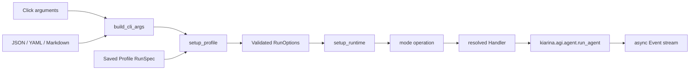
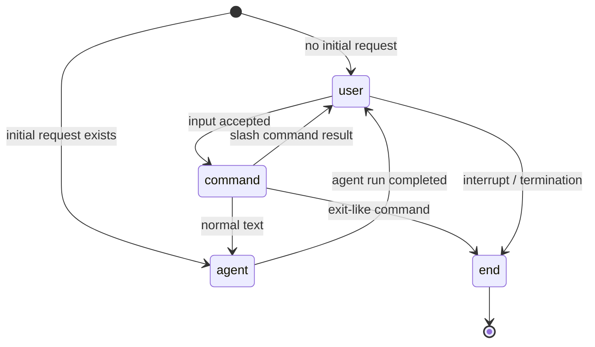
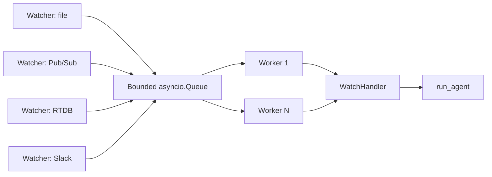
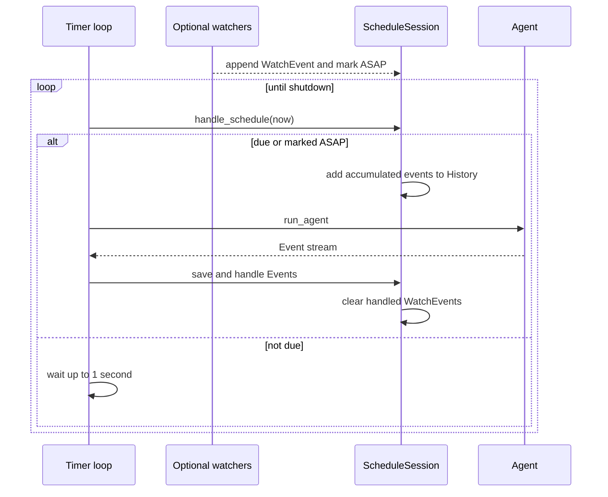

# Execution Modes

この文書は、kiari の 4 つの主要実行モードが、共通の agent engine をどのように駆動するかを説明します。全体の package 境界は [kiari Architecture](../../ARCHITECTURE.md) を参照してください。

## Common Bootstrap

batch、console、watch、schedule は、実行開始まで同じ手順を使います。

CLI の入力値のうち、実行設定として再利用できる値は `RunSpec` へ入ります。本文、添付、stdin など今回だけの入力は `extra_args` として分離され、Request に変換されます。

`cli.run()` は mode operation を `try/finally` で囲み、最後に `RunOptions.finalizers` を必ず実行します。一方、各 Handler の context manager は Session 単位の完了・エラー hook と cost recorder の flush を所有します。

## Batch Mode

入口は `kiari/cli/batch/cli.py`、実行ループは `kiari/cli/batch/_operations/run_batch.py` です。

1. Markdown 本文、stdin、位置引数の text を結合し、`BatchRequest` を作る。
2. `batch_handler_registry` から Handler を解決する。既定は `VanillaBatchHandler`。
3. Handler が History をロードまたは構築し、request を user event として追加して `BatchSession` を作る。
4. `run_agent()` の Event を順に Handler へ渡す。
5. non-transient Event ごとに、`no_save` でなければ History を repository へ保存する。
6. `--output-text` が有効なら、最後の Event の text を標準出力へ出す。

batch は 1 request、1 Session、1 agent run です。シェルスクリプトやパイプから使う場合に最も単純な実行経路です。

## Console Mode

入口は `kiari/cli/console/cli.py`、状態機械は `kiari/cli/console/_operations/run_console.py` です。

Console Session は複数 request にまたがって同じ History と RunContext を保持します。主な固有機能は次のとおりです。

- `prompt_toolkit` による multiline 入力、completion、vi/emacs editing mode
- `/...` 入力を `slash_command_registry` で解決する slash command
- Enter を stop event に変換し、進行中の agent run を中断する制御
- audio source、VAD、ASR を組み合わせた音声入力
- tool call を含まない最終 AI message に対する TTS 再生
- Handler による status/hint と Event の terminal rendering

Console の機能を追加するときは、状態遷移を operation に、差し替え可能な入出力方針を Handler または slash command に置きます。Session に閉じる状態を module-level singleton に逃がさないことが重要です。

## Watch Mode

入口は `kiari/cli/watch/cli.py`、producer/consumer 制御は `kiari/cli/watch/_operations/run_watch.py` です。

Watcher はサービス固有の入力を共通の `WatchEvent` へ正規化します。WatchHandler は Event から RunContext、History、agent 入力を持つ `WatchSession` を作り、agent Event の保存と出力を担当します。

並行制御には 3 つの `RunOptions` が関係します。

- `watch_max_concurrent`: queue を読む worker 数
- `watch_queue_size`: 未処理 Event を保持する上限
- `watch_queue_put_timeout`: queue が空くまで producer が待つ上限

待機が timeout すると Event は drop され、Handler の `on_queue_full()` が呼ばれます。終了時は watcher を止めた後、すでに queue に入った Event の完了を待ち、worker ごとに sentinel を投入します。

既定 Handler は標準ライフサイクルだけを提供します。`SlackWatchHandler` は Slack の team/channel/thread から RunContext を分離し、AI text と tool artifact の file を元の Slack thread へ返します。

## Schedule Mode

入口は `kiari/cli/schedule/cli.py`、長寿命 loop は `kiari/cli/schedule/_operations/run_schedule.py` です。

schedule は `--interval` または `--cron` のどちらか一方を必要とします。Handler は Scheduler、次回実行時刻、History、蓄積した watch Event を持つ 1 つの `ScheduleSession` を作ります。

Watcher は schedule の必須要素ではありません。設定されている場合は、Event を Session に蓄積すると同時に `is_asap` を立てるため、通常の次回時刻より前に実行できます。`skip_if_no_events` が有効なら、時刻が来ても蓄積 Event がない実行を省略します。

各 WatchEvent は、作成時刻を RunContext の time zone に変換した注記とともに History へ追加されます。処理済み Event を成功時・失敗時に消すかどうかは Handler の property で変更できます。

## Extension Commands

`kiari ext` は agent loop を直接回す実行モードではありませんが、同じ Profile と runtime bootstrap を通ります。`extension_command_registry` に登録された command を解決し、`ExtensionCommandContext` と未加工の追加引数を渡します。

これにより、plugin は kiari/kiarina の設定と runtime context を利用する補助コマンドを、ルート Click command を変更せず追加できます。

## FastAPI Mode

`kiari fastapi` は CLI process と ASGI worker の境界を持つ長寿命モードです。CLI は他 mode と
同じ `build_cli_args()` と `setup_profile()` で Profile 名と RunOptions を確定し、version 付き
startup payload を permission `0600` の一時 JSON file に保存します。uvicorn の reload process
と worker には環境変数で file path だけを渡します。

worker は `kiari.fastapi.app:create_app` を factory として読み、payload を再検証します。Profile
RunSpec は再合成せず、FastAPI lifespan 内で `setup_runtime()` を実行して component config、plugin、
logger を worker ごとに初期化します。終了時の finalizer も lifespan が所有します。

HTTP request は `FastAPIRequest` に正規化され、`BaseFastAPIHandler` が認証、request 用 RunOptions、
RunContext、History、Session、保存、cost flush を担当します。agent Event は
`application/x-ndjson` で streaming され、stream 開始後の実行エラーは error payload を持つ
`CustomEvent` として返ります。

`kiari/cli/fastapi` は server 起動 interface に限定され、HTTP request や agent lifecycle を
持ちません。逆に `kiari/fastapi` は Click、CLIArgs、CLI helper に依存しません。

## Streamlit Mode

`kiari streamlit` は GUI を持つ console 相当の長寿命モードです。CLI process は FastAPI と同じく
確定済み Profile 名と RunOptions を permission `0600` の version 付き一時 JSON に書き、Streamlit
child process へ file path だけを渡します。app process は RunSpec を再合成せず runtime を一度だけ
初期化します。

ブラウザ session は StreamlitAuthenticator から user identity を取得し、所有が確認された agent ID
と組み合わせて RunContext を作ります。agent ごとの StreamlitSession は複数 request にまたがって
History と AGI options を保持します。request 開始時に永続 History を再読込し、同じ agent の多重
実行は process-wide lock で拒否します。

UI の YAML override は agent/tool/workflow/prompt/chat と音声の session option に限定されます。
Profile、plugin、component config、repository、認証、logger、server option は startup snapshot から
変更しません。agent Event の保存、cost flush、エラー処理は StreamlitHandler が所有し、widget は
agent engine を直接駆動しません。

## Handler Responsibilities

各モードの Handler は、次の責務を共通化します。

- Session と RunContext を作る
- History をロードし、入力 Event を追加する
- agent Event を受け、必要なら History を保存する
- 成功、エラー、終了時の hook を提供する
- cost recorder を flush する

Handler が所有しない責務は次のとおりです。

- CLI 引数の解析と RunSpec の保存
- global/Profile/component config のロード
- agent の iteration と tool dispatch
- process 全体で共有するリソースの最終 cleanup

この境界を保つことで、同じ Handler を別の入力 adapter から使い、同じ agent engine を複数のモードから利用できます。

schedule / watch operation は、Handler が組み立てた Session を必ず
`kiarina.agi.agent.run_agent()` へ渡す。workflow と tool の実行場所をローカル・外部サービスへ
振り分ける実行戦略は、Handler ではなく kiarina の `Agent` template method
（`_run_workflow()` / `_run_tool()`）で差し替える。Handler はモード固有の入力、時刻・キュー、
Session、Event出力、終了処理に責務を限定する。

## Failure and Shutdown Semantics

- Handler context は例外を記録して mode 固有の error hook を呼び、batch/watch/console では基本的に上位へ再送出する。
- schedule の request error は長寿命 Session 全体を止めないよう request context 内で扱われる。
- Streamlit の request error は画面へ表示し、別 agent と次の request は継続可能にする。
- Session の終了処理と cost flush は `finally` で行う。
- watch と schedule の長寿命 task は graceful shutdown の stop event を監視する。
- watch mode は処理成功後に `WatchEvent.acknowledge()`、失敗・キャンセル・queue timeout時に
  `WatchEvent.release()` を呼ぶ。通常のWatcherではno-opで、Pub/Sub watcherはACKまたは
  ack deadline 0による再配信へ対応する。Pub/Sub messageはHandler処理前にはACKしない。
- process 全体の subprocess は、mode operation 終了後に finalizer が片付ける。
- Chrome Bridge の lease は `chrome` tool の action ごとに取得し、その action の終了時に解放する。managed server とユーザーの Chrome は終了しない。

新しいモードを追加する場合も、「入力 adapter → 検証済み RunOptions → Session → `run_agent` → Event Handler → finalizer」という共通形を維持してください。
