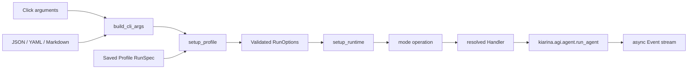
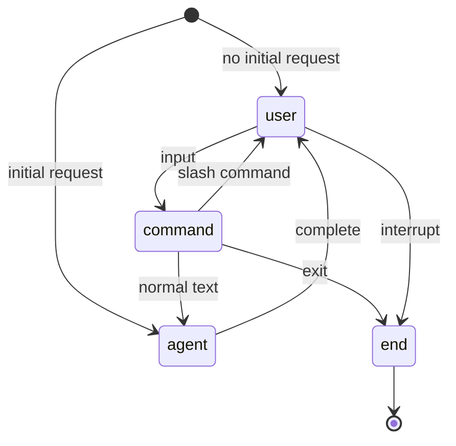

# Execution Modes

This document explains how kiari execution modes drive the shared agent engine. See
[kiari Architecture](../../ARCHITECTURE.md) for package boundaries.

## Common Bootstrap

Persistable execution settings become `RunSpec`. Request-only text, attachments, and
stdin become `extra_args` and then request objects. `cli.run()` always invokes
process-level finalizers; handler contexts own session hooks and cost flushing.

## Batch Mode

Batch mode runs one request in one session.

1. Combine Markdown body, stdin, and positional text into `BatchRequest`.
2. Resolve a handler, normally `VanillaBatchHandler`.
3. Load or create history, add the user event, and create `BatchSession`.
4. Pass agent events to the handler.
5. Save history after non-transient events unless `no_save`.
6. Print the final event text when `--output-text` is enabled.

Entry points are `kiari/cli/batch/cli.py` and
`kiari/cli/batch/_operations/run_batch.py`.

## Console Mode

Console mode keeps one history and `RunContext` across multiple requests.

It provides multiline editing, completion, slash commands, stop-on-Enter behavior, speech
input, TTS output, and terminal rendering. Keep state transitions in the operation and
replaceable I/O behavior in handlers or slash commands. Do not move session state into
module-level singletons.

## Watch Mode

Watchers normalize service input into `WatchEvent` objects and feed a bounded
`asyncio.Queue`. Workers create sessions and run the agent.

- `watch_max_concurrent`: worker count
- `watch_queue_size`: pending-event capacity
- `watch_queue_put_timeout`: producer wait limit

A timed-out enqueue drops the event and invokes `on_queue_full()`. Shutdown stops
watchers, drains queued work, and then terminates workers. Successful processing calls
`acknowledge()`; failure, cancellation, and timeout call `release()`. Pub/Sub uses these
methods for ACK and redelivery and is never acknowledged before handler processing.

`SlackWatchHandler` maps team, channel, and thread to context identity and replies with
AI text and tool artifacts in the originating thread.

## Schedule Mode

`run_schedule` is a public API exported from `kiari.cli.schedule`. It accepts an
external `stop_event` and requires exactly one of interval or cron scheduling.

One long-lived `ScheduleSession` owns the scheduler, next run time, history, and optional
accumulated watcher events. Watcher input can mark a run as ASAP. `skip_if_no_events`
skips timer runs without accumulated events. Handlers decide whether processed watcher
events are cleared after success or failure.

## Extension Commands

`kiari ext` uses the same profile and runtime bootstrap but does not run the agent loop.
It resolves an `ExtensionCommand` and passes an `ExtensionCommandContext` plus raw
arguments. Plugins can therefore add configured operational commands without changing the
root Click command.

## FastAPI Mode

The CLI writes a versioned startup payload containing the profile and validated options to
a permission-0600 temporary JSON file. Uvicorn workers receive only its path.

Each worker validates the payload, initializes runtime in the FastAPI lifespan, and does
not recompose the profile's `RunSpec`. Requests become `FastAPIRequest` objects.
`BaseFastAPIHandler` owns authentication, request options, context, history, session,
persistence, and cost flushing. Events stream as `application/x-ndjson`; an error after
streaming starts is represented as a custom error event.

`kiari/cli/fastapi` launches the server but does not own HTTP lifecycle.
`kiari/fastapi` does not depend on Click or CLI helpers.

## Streamlit Mode

Streamlit uses the same protected startup-payload boundary. The app initializes runtime
once. Each browser session obtains an identity from `StreamlitAuthenticator`, validates
ownership of an agent ID, and creates a corresponding context and session.

Sessions retain history and AGI options across requests, reload persistent history at
request start, and reject concurrent runs for the same agent with a process-wide lock.
YAML overrides are limited to session-local agent, tool, workflow, prompt, chat, and speech
options. Startup-wide profiles, plugins, repositories, authentication, logging, and server
options remain fixed.

## Handler Responsibilities

Handlers create sessions and contexts, load history, add input events, process agent
events, save history, run lifecycle hooks, and flush cost data. They do not parse CLI
arguments, load process-wide configuration, implement agent iterations, or clean up
process-wide resources.

Watch and schedule handlers always pass sessions to
`kiarina.agi.agent.run_agent()`. Local or remote workflow/tool execution strategy belongs
to the kiarina agent template methods, not to mode handlers.

## Failure and Shutdown

- Handler contexts record errors, invoke mode hooks, and normally re-raise.
- Schedule request failures do not stop the long-lived session.
- Streamlit displays request failures while preserving other agents and future requests.
- Session cleanup and cost flushing run in `finally`.
- Long-lived modes observe graceful-shutdown stop events.
- Process-level subprocesses are cleaned up by finalizers.
- Each Chrome action releases its lease; kiari does not stop the managed server or Chrome.

New modes must preserve the common shape:
`input adapter → RunOptions → Session → run_agent → event handler → finalizer`.
