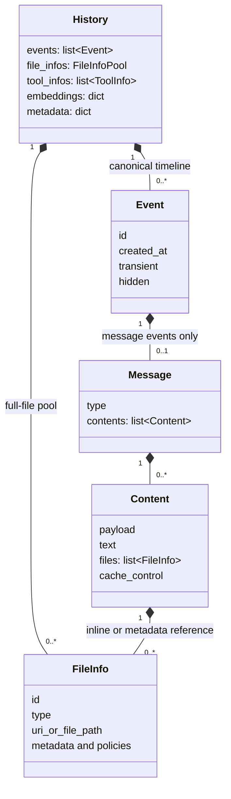
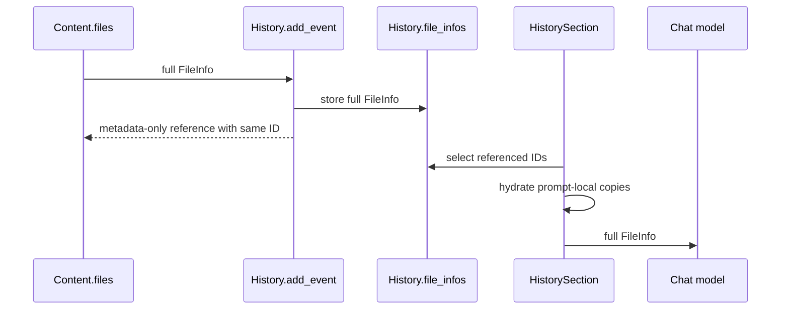
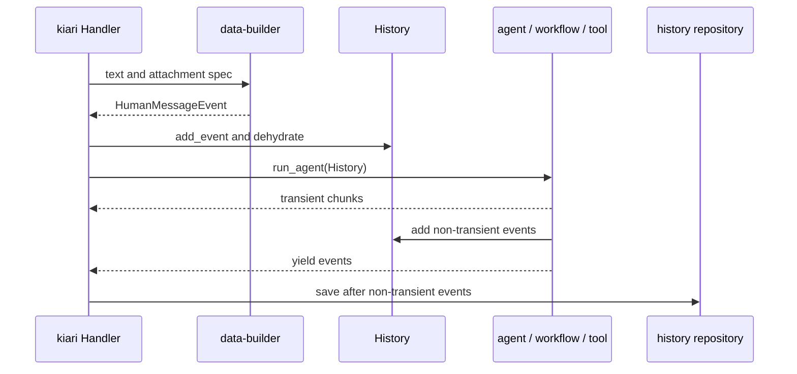

# Data Model and History

kiari represents conversation state with `History`, `Event`, `Message`, `Content`,
and `FileInfo` from kiarina-agi-data. These are separate boundaries for persistence,
streaming, chat roles, provider input, and attachments.

See [Documented Versions](overview.md#documented-versions) and
[FileInfo and Data Builder](file-info-and-data-builder.md).

## Ownership Model

The normal chain is `History → Event → Message → Content → FileInfo`. Full
`FileInfo` objects may be moved to the history file pool while content retains a
metadata-only reference with the same ID.

## Responsibilities by Type

| Type | Responsibility |
| --- | --- |
| `History` | Aggregate root persisted across iterations and runs; owns events, files, tools, embeddings, and metadata |
| `Event` | Lifecycle envelope emitted asynchronously by agents, prompts, and tools |
| `Message` | System, human, AI, or tool role and role-specific data |
| `Content` | One provider input block containing native payload, text, files, and cache control |
| `FileInfo` | File type, location, metadata, estimates, segments, and runtime policies |

A history is not a provider-ready message list. The local repository serializes
`History.model_dump(mode="json")` and restores it with `History.model_validate()`.

## Events and Messages Are Different Layers

| Event | Message | Persistence |
| --- | --- | --- |
| `HumanMessageEvent` | `HumanMessage` | Normally persisted |
| `AIMessageEvent` | `AIMessage` | Persisted as a response or tool call |
| `AIMessageChunkEvent` | `AIMessageChunk` | Transient by default |
| `ToolMessageEvent` | `ToolMessage` | Persisted as a tool result |
| `CustomEvent` | none | May persist, but is excluded from `get_messages()` |

`message_to_event()` wraps a concrete message. `History.get_messages()` projects only
human, AI, and tool message events, losing event metadata and custom events.

A `SystemMessage` is usually built at prompt time from sections rather than persisted in
the conversation timeline. Transient events are yielded to UIs but are not added to
history or used to trigger repository saves. kiari does not universally filter `hidden`
events.

## Message Variants and Tool Calls

- `SystemMessage`: provider system instructions
- `HumanMessage`: user or watcher input and attachments
- `AIMessage`: response content and zero or more `ToolCall` objects
- `AIMessageChunk`: streaming intermediate content and optional tool-call chunks
- `ToolMessage`: result linked to a tool call by `tool_call_id`

A tool call contains `id`, `name`, and `args`. `get_pending_tool_calls()` scans the
end of a conversation for calls without corresponding tool messages.

`ToolMessage` separates data by use:

- `contents`: result sent to the next LLM call
- `artifact`: structured provider or application result
- `metadata`: execution metadata
- `display_contents`: user-facing output not sent through the standard provider path
- `failed`: provider error status
- `return_direct`: whether the agent loop stops after the tool result

## Content Is the Provider Block Boundary

A message may contain multiple content blocks. Each block may contain a native `payload`,
portable `text`, `files`, and `cache_control`. Structural fields such as `tag`,
`description`, `template`, and `file_tags` control XML representation.

Do not flatten content blocks casually: doing so can change cache boundaries and native
block ordering. `Content.to_text()` is a generic debug representation, not necessarily
the exact provider input.

## File Pool: Dehydrate and Hydrate

`History.add_event()` and `replace_event()` dehydrate normal files before persistence.
Two policies bypass the pool:

- `inline=True`: keep the full file in content
- `metadata_only=True`: keep only reference information in content

`History.get_messages()` does not hydrate files. `HistorySection` selects full pool
items by ID and hydrates prompt-local copies. Resizing also occurs on section-local data,
not on the persisted history.

## End-to-End Lifecycle in kiari

A typical tool loop is:

1. Add a human message event.
2. Build prompt messages and finalize an AI message containing a tool call.
3. Resolve the pending call in the next iteration.
4. Add a tool message with the same `tool_call_id`.
5. Rebuild human, AI, and tool messages and produce the final AI response.

Custom agent `pre_run()` and `post_run()` events must explicitly perform any required
history mutation.

## Builders and Direct Constructors

| Builder | Conversion |
| --- | --- |
| `build_content()` | string or content spec to `Content`, loading file specs |
| `build_message()` | string or message spec to a concrete message |
| `build_event()` | message input or custom tuple to an event |
| `build_history()` | event, file, and tool specs to a dehydrated `History` |

Convenience `create()` methods are appropriate for one content block. Use explicit models
or builders for multiple blocks, native payloads, cache control, or tool-specific fields.

## Development Rules

- Use message events for conversational state, transient events for progress, and custom
  events for non-conversation control signals.
- Mutate history through `add_event()`, `add_message()`, and `replace_event()`, not by
  appending directly.
- Never assume `get_messages()` returns full file data; use prompt-time hydration.
- Separate LLM tool content, user display content, and structured artifacts.
- Do not persist both streaming chunks and the completed AI message.
- When changing files or builders, verify pool serialization, hydration, adjustment, and
  provider conversion.

## Canonical Sources

| Concern | Source |
| --- | --- |
| Aggregate and projections | `kiarina-agi-data/.../history/_models/history.py` |
| Events | `kiarina-agi-data/.../event/` |
| Messages and tool calls | `kiarina-agi-data/.../message/` |
| Provider content | `kiarina-agi-data/.../content/` |
| File policies | `kiarina-agi-data/.../file_info/` |
| Hydration | `kiarina-agi-data/.../file_info_pool/` |
| Builders | `kiarina-agi-data-builder/.../{content,message,event,history}_builder/` |
| Prompt hydration and resizing | `kiarina-agi-flow/.../section_impl/history/` |
| Transient handling | `kiarina-agi-runner/.../agent/` |
| kiari persistence | `kiari/lib/history_repository/`, `kiari/impl/history_repository_impl/` |

`AssetRepository` is an authorization boundary for agent-managed data and cache assets;
it is not a lower-level adapter for history control state. Use `GCSHistoryRepository` for
service-account access to GCS and `FirebaseStorageHistoryRepository` for Firebase
Storage access with an ID token. They may share object storage, but history objects must
not be added to the `AssetRepository` URI policy.
