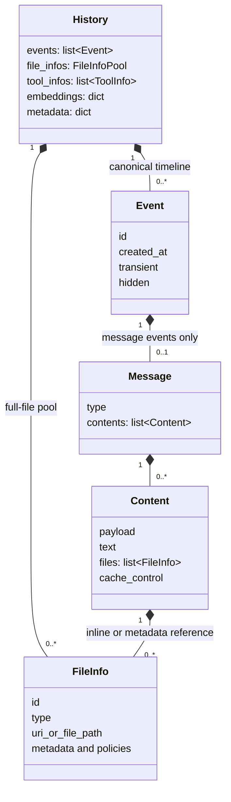
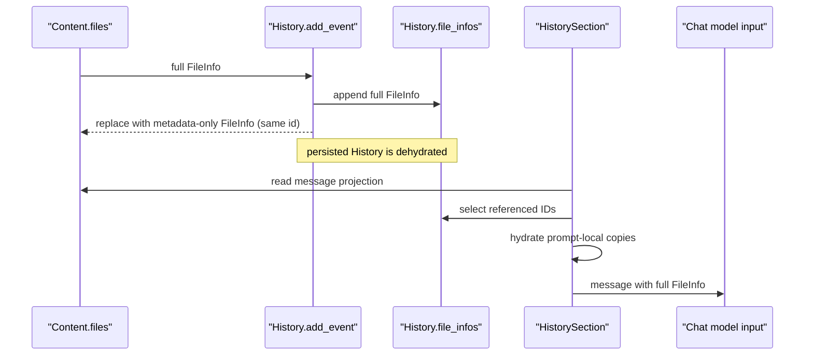
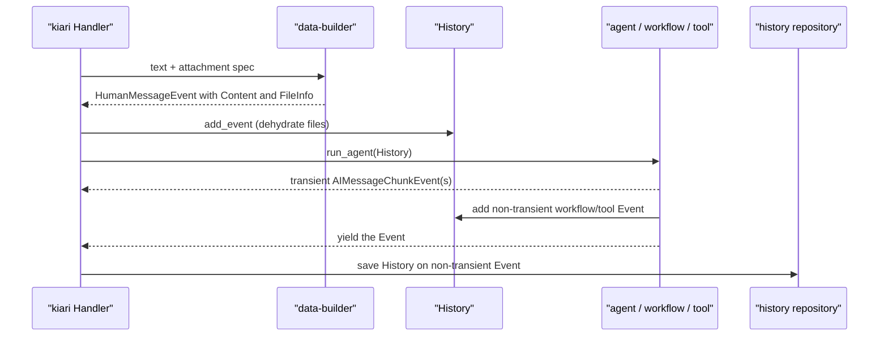

# Data Model and History

kiari の会話状態は `kiarina-agi-data` の `History`、`Event`、`Message`、`Content`、
`FileInfo` で表現します。これらは似たデータの別名ではなく、永続化、event stream、会話上の役割、
provider 入力、添付ファイルという異なる境界を担当します。

前提バージョンは [overview.md](overview.md#documented-versions) を参照してください。
`FileInfo` の各ポリシーと生成経路は
[FileInfo and Data Builder](file-info-and-data-builder.md) を参照してください。

## The Ownership Model

通常の包含関係は `History → Event → Message → Content → FileInfo` です。ただし、完全な
`FileInfo` は History の file pool に退避され、Content 側には同じ `id` を持つ metadata-only の
参照だけが残る場合があります。そのため FileInfo だけは Content と History の二層にまたがります。

## Responsibilities by Type

| Type | Responsibility | What it does not mean |
| --- | --- | --- |
| `History` | agent が次の iteration と次回実行へ引き継ぐ aggregate root。event timeline、file pool、tool state、embedding、任意 metadata を保持する。 | prompt にそのまま送る message list ではない。 |
| `Event` | agent / prompt / tool が非同期に流す lifecycle envelope。時刻、ID、永続性に関わる属性と、message または custom payload を持つ。 | すべてが会話 message になるわけではない。 |
| `Message` | system / human / ai / tool という chat 上の役割と、その役割固有の情報を表す。 | streaming、永続化、表示タイミングを単独では決めない。 |
| `Content` | 1 message 内の provider 入力 block。native payload、text、files、cache control をまとめる。 | UI 表示専用データではない。 |
| `FileInfo` | ファイルの型、場所、metadata、見積り、segment、実行時ポリシーを表す。 | ファイル bytes 自体ではない。実体取得は `kiarina-agi-file` が担う。 |

`History` は `events` のほかに次を直接持ちます。

- `file_infos`: message から分離した完全な FileInfo の pool と、message 外の context file。
- `tool_infos`: agent が利用できる tool の説明と状態。
- `embeddings`: ID で引ける embedding。
- `metadata`: application 固有の補助状態。

kiari の local history repository は `History.model_dump(mode="json")` を保存し、読み込み時に
`History.model_validate()` で union を復元します。したがって History が永続化の正典であり、
個々の Message や Content を別々に保存する構造ではありません。

## Event and Message Are Different Layers

message を伴う Event は次の対応です。

| Event | Message | Persistence behavior |
| --- | --- | --- |
| `HumanMessageEvent` | `HumanMessage` | 通常は History に残る。 |
| `AIMessageEvent` | `AIMessage` | 完成した応答または tool call として History に残る。 |
| `AIMessageChunkEvent` | `AIMessageChunk` | `transient=True` が既定。stream 表示には流れるが agent は History に追加しない。 |
| `ToolMessageEvent` | `ToolMessage` | 対応する tool call の結果として History に残る。 |
| `CustomEvent` | なし。`payload` を直接持つ。 | `transient` でなければ History に置けるが、`History.get_messages()` の結果には入らない。 |

`message_to_event()` は Message の concrete type を対応する Event に包みます。反対に
`History.get_messages()` は `human_message`、`ai_message`、`tool_message` Event から Message だけを
取り出します。Event の `id`、`created_at` や CustomEvent はこの projection では失われます。

`SystemMessage` は Message union には含まれますが、対応する persisted Event type はありません。
標準 prompt では section 群の system text から `SectionContainer` が実行時に組み立てます。つまり
system prompt は通常、History の会話 timeline ではなく prompt 構成側の責務です。

`transient` は agent と kiari の保存境界で実際に使われます。標準 `BaseAgent.run()` は workflow / tool
からの transient Event を `History.add_event()` せず、kiari の Handler もその Event を契機に
history repository を保存しません。
ただし Event 自体は呼び出し側へ yield されるため、streaming UI などは処理できます。
`hidden` も Event の共通 field ですが、現在の kiari Handler はこれを一律に filter していません。

## Message Variants

| Message | Additional data and role |
| --- | --- |
| `SystemMessage` | provider への system instruction。標準構成では prompt section から一時的に生成される。 |
| `HumanMessage` | ユーザー入力、watch event からの入力、添付ファイル。 |
| `AIMessage` | 応答内容に加え、0 個以上の `ToolCall` を持つ。 |
| `AIMessageChunk` | streaming 中間値。`tool_call_chunks` を持ち得る。完成後の `AIMessage` とは別物。 |
| `ToolMessage` | `tool_call_id`、tool 名、入力 args、成功失敗、`return_direct`、artifact、metadata、表示用 content を持つ。 |

`ToolCall` は `id`、`name`、`args` を持ちます。`ToolMessage.tool_call_id` がその ID を参照するため、
AI の要求と tool の結果を対応づけられます。`History.get_pending_tool_calls()` は会話末尾を逆向きに
調べ、まだ ToolMessage がない ToolCall を agent の次の実行対象として返します。

`ToolMessage` のデータは用途別に分かれています。

- `contents`: 次の LLM 呼び出しへ渡す結果。
- `artifact`: provider / application が保持する構造化された付随結果。LangChain ToolMessage にも渡る。
- `metadata`: tool 実行に関する補助情報。
- `display_contents`: terminal など利用者向け表示。標準 chat provider の入力にはしない。
- `failed`: provider 側の tool result status を error にする。
- `return_direct`: agent loop が tool 結果後に終了するかを決める。

## Content Is the Provider Block Boundary

Message は `contents: list[Content]` を持ち、1 message の中に複数 block を保持できます。Content の
主要 field は次のとおりです。

| Field | Meaning |
| --- | --- |
| `payload` | provider-native な content dict。変換時にほぼそのまま渡す。 |
| `text` | portable な text。 |
| `files` | text / image / audio / video / PDF / other の FileInfo。 |
| `cache_control` | provider cache の境界情報。 |
| `tag`, `description`, `template`, `file_tags` | text file や metadata を XML 表現にするときの構造。 |

`payload`、`files`、`text` は同じ Content に共存でき、chat provider はこの順序で変換結果へ追加します。
複数 Content を 1 個へ平坦化すると cache boundary や native block の順序が変わり得るため、builder や
tool が意図して分けた Content は安易に統合しません。

`Content.to_text()` は debug / console 向けの汎用 text 表現です。実際の model 入力は chat provider が
capability と Message type を考慮して変換するため、`to_text()` の出力と常に同一ではありません。

## FileInfo Pool: Dehydrate and Hydrate

ファイル内容を各 Event に重複保存せず、History 全体で調整できるようにする仕組みが
`FileInfoPool` と hydrate / dehydrate です。

`History.add_event()` と `replace_event()` は保存前に Event を dehydrate します。処理は
Event → Message → Content → FileInfo の順に降り、通常の完全な FileInfo を pool に追加して、
Content 側を `as_metadata_only()` の結果へ置き換えます。両者は同じ `FileInfo.id` で結びます。

例外は次の 2 つです。

- `inline=True`: 完全な FileInfo を Content 内に残し、pool へ移さない。
- `metadata_only=True`: すでに参照情報だけなので、そのまま Content 内に残す。

重要なのは、`History.get_messages()` が hydrate を行わないことです。これは Event から Message を
抽出するだけなので、通常は metadata-only の FileInfo を含む dehydrated Message が返ります。
標準 prompt の `HistorySection` が message から参照される pool item を `id` で選び、prompt 用の copy を
hydrate してから model へ渡します。

hydrate は pool から一致する完全な FileInfo を pop して Content の参照と交換します。この操作は
HistorySection が保持する list / model copy に対して行われ、永続化された History 自体を展開状態へ
書き換えるものではありません。prompt の token resize も同様に section-local な pool を縮小します。

`History.get_file_infos(in_message=True)` の「in message」は、pool 内 FileInfo の `id` が History の
dehydrated Message から参照されているかで判定します。`inline` FileInfo は message にありますが pool に
ないため、この query の返却対象にはなりません。

## End-to-End Lifecycle in kiari

batch / console / watch / schedule Handler は入力を `build_event()` で HumanMessageEvent にし、
`History.add_event()` で会話へ追加します。agent は iteration ごとに History を読み、workflow または
tool を実行します。標準 `BaseAgent.run()` は workflow / tool が生成した非 transient Event を History に
追加してから Handler へ yield するため、Handler が repository を保存する時点では新しい Event が
すでに含まれています。custom agent の `pre_run()` / `post_run()` が独自 Event を流す場合は、必要な
History 変更もその実装側で明示します。

典型的な tool loop は次の順です。

1. HumanMessageEvent が History に入る。
2. prompt が History から Message を組み立て、AIMessageChunkEvent を流した後、ToolCall を持つ
   AIMessageEvent を確定する。
3. 次 iteration で `get_pending_tool_calls()` が未完了の ToolCall を返す。
4. tool が同じ `tool_call_id` の ToolMessageEvent を返す。
5. 次の prompt が Human / AI / Tool Message を再構成し、最終 AIMessageEvent を生成する。

## Builders and Direct Constructors

`kiarina-agi-data` の model は直接生成できますが、外部入力から組み立てる場合は
`kiarina-agi-data-builder` が層ごとの builder を提供します。

| Builder | Conversion |
| --- | --- |
| `build_content()` | string / Content spec → Content。file spec があれば FileInfo を load する。 |
| `build_message()` | string / Message spec → Human / AI / Tool Message。通常の spec からは Content 1 個を作る。 |
| `build_event()` | message input / custom tuple → 対応 Event。 |
| `build_history()` | event / file / tool spec → History。Event は `add_event()` を通すため dehydrate される。 |

単純な text と files だけなら `HumanMessage.create()`、`AIMessage.create()`、`ToolMessage.create()` や
各 Event の `create()` が Content 1 個を作ります。複数 Content、native payload、cache control、
ToolMessage 固有属性が必要な場合は model または builder へ明示します。

## Development Rules of Thumb

- 会話として次回も参照するものは Message Event にする。一時的な進捗通知は transient Event、
  会話以外の制御通知は CustomEvent を検討する。
- History を変更するときは `events` へ直接 append せず、file dehydration が必要なため
  `add_event()` / `add_message()` / `replace_event()` を使う。
- `History.get_messages()` の FileInfo が完全だと仮定しない。model 入力が必要なら標準
  HistorySection の hydrate 経路を使う。
- LLM に渡す tool 結果は `ToolMessage.contents`、利用者だけに見せるものは `display_contents`、
  構造化された付随結果は `artifact` と用途を分ける。
- streaming chunk と完成した AIMessage を両方 History に保存しない。標準の
  `AIMessageChunkEvent.transient=True` を維持する。
- FileInfo の field や builder を変えるときは、pool の serialize / hydrate と provider 変換まで確認する。

## Canonical Sources

| Concern | Source |
| --- | --- |
| aggregate and projections | `kiarina-agi-data/.../history/_models/history.py` |
| Event union and message wrapping | `kiarina-agi-data/.../event/` |
| Message variants and tool-call matching | `kiarina-agi-data/.../message/` |
| provider block model | `kiarina-agi-data/.../content/` |
| FileInfo union and policies | `kiarina-agi-data/.../file_info/` |
| hydrate / dehydrate | `kiarina-agi-data/.../file_info_pool/` plus `content/`, `message/`, `event/` helpers |
| external-input construction | `kiarina-agi-data-builder/.../{content,message,event,history}_builder/` |
| prompt-time hydration and resize | `kiarina-agi-flow/.../section_impl/history/` |
| agent mutation and transient handling | `kiarina-agi-runner/.../agent/` |
| kiari persistence | `kiari/lib/history_repository/` and `kiari/impl/history_repository_impl/` |
