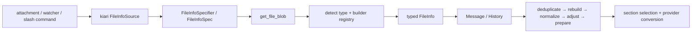

# FileInfo and Data Builder

kiari represents attachments and tool artifacts with `FileInfo`, not plain paths.
`FileInfo` flags are runtime policies that affect persistence, deduplication, limit
adjustment, and provider conversion.

See [Documented Versions](overview.md#documented-versions) and
[Data Model and History](data-model-and-history.md).

## Package Boundaries

| Package | Responsibility |
| --- | --- |
| `kiarina-agi-data` | File models, history pool, and basic operations |
| `kiarina-agi-file` | Blob retrieval, caches, and asset/local repositories |
| `kiarina-agi-data-builder` | Type detection, construction, rebuilding, normalization, and adjustment |
| `kiarina-agi-runner` | Ordered pre-run processing |
| `kiarina-agi-flow` | File selection for prompt sections |
| `kiarina-agi-text` | Provider text and media conversion |

Start file retrieval changes in kiarina-agi-file, policy changes in kiarina-agi-data, and
construction changes in kiarina-agi-data-builder.

## From kiari Input to FileInfo



`resolve_file_info_specifiers()` accepts paths, URIs, JSON specs, local patterns, and
GitHub patterns. Batch and console attachments, watcher events, and the `/attach` and
`/file-info` commands share this entry point.

Before each agent run, files are generally processed in this order:

1. Dehydrate normal message files into the history pool.
2. Deduplicate by `unique_key`.
3. Rebuild changed local files while preserving their original specs.
4. Normalize multiple segments of the same path or URI.
5. Remove or shrink non-pinned files to fit chat limits.
6. Prepare provider assets for media and PDFs.

## Capability-Aware PDF and Video Analysis

PDF and video builders default to `analysis_enabled=False`. When enabled they produce a
`FileBundle` whose alternatives depend on model capability.

| Input | Capability | Selected content |
| --- | --- | --- |
| PDF | PDF | Original PDF or page segment |
| PDF | image | Numbered page images and extracted text |
| PDF | text | Extracted text |
| Video | video | Video with audio track |
| Video | image | Timestamped frames, transcript, and ambient events |
| Video | text | Transcript and ambient events |

`analysis_dpi` defaults to 144 and controls PDF fallback images. `analysis_fps` defaults
to 1.0 and controls video and frame preparation. Both must be positive.

Enable analysis through component configuration or the PDF/video builder factories. Pass
per-file resolution values through a JSON spec:

```sh
kiari -a '{"uri_or_file_path":"report.pdf","analysis_dpi":144}' 'Analyze this report'
kiari -a '{"uri_or_file_path":"demo.mp4","analysis_fps":1.0}' 'Analyze this video'
```

Bundle manifests use visibility rules and optional prefix text. Providers select entries
for the active model capability.

## Behavioral Parameters

| Parameter | Meaning |
| --- | --- |
| `pinned` | Exclude the file from pre-run count, page, size, duration, and token adjustment; prompt-section resizing may still apply |
| `inline` | Keep full file data in message content instead of moving it to the history pool |
| `metadata_only` | Send only path, name, description, and other metadata |
| `content_only` | Omit metadata wrappers and send content or media only |
| `no_merge` | Keep consecutive text-file representations as separate provider blocks |
| `group` | Label files for section selection; does not sort, merge, or deduplicate |
| `unique_key` | Keep only the newest pool item with the same logical key |
| `keep_from_end` | Preserve trailing lines, time, or pages when shrinking a segment |

### Interactions

- `metadata_only` takes precedence over `content_only`.
- `pinned` does not overcome missing model capabilities or retrieval failures.
- `inline` keeps full content; `metadata_only` keeps only a reference. Neither is moved
  into the history pool.
- Inline files bypass pool deduplication, rebuilding, normalization, and limit adjustment.
- `unique_key` applies across groups. Include the group in the key when deduplication
  should be group-specific.
- Reusing one key for multiple segments removes all but one before segment normalization.
- `no_merge` affects provider text blocks, not segment normalization.

## Specifying Policies in kiari

Use a quoted query string for simple values:

```sh
kiari -a 'README.md?pinned=true&group=project&unique_key=project-readme' \
  'Read the project context'

kiari -a 'src/?include=*.py&exclude=test_*.py&group=source' \
  'Review these sources'
```

Use JSON when preserving types, null values, segment ranges, or templates:

```sh
kiari -a '{"uri_or_file_path":"app.log","keep_from_end":true,"unique_key":"app-log"}' \
  'Inspect the latest log lines'
```

## Choosing Parameters

- Preserve the complete file before adjustment: `pinned=True`
- Keep the attachment in its message: `inline=True`
- Tell the model only that a file exists: `metadata_only=True`
- Send content without path or XML metadata: `content_only=True`
- Keep independent text blocks: `no_merge=True`
- Select files by prompt section: `group`
- Keep the newest logical file: `unique_key`
- Prefer the tail of logs or append-only files: `keep_from_end=True`

Tool-produced files follow the same rules. Subprocess output uses `keep_from_end=True`
because the newest lines are usually most useful.

## Canonical Sources

| Concern | Source |
| --- | --- |
| Fields and shrinking | `kiarina-agi-data/.../file_info/_models/` |
| Pool hydration | `kiarina-agi-data/.../file_info_pool/` |
| Deduplication | `kiarina-agi-data/.../deduplicate_file_infos.py` |
| Parsing and builders | `kiarina-agi-data-builder/.../file_info_builder/` |
| PDF/video bundles | `kiarina-agi-data-builder/.../file_info_builder_impl/{pdf,video}/` |
| Normalization and limits | `file_segment_normalizer/`, `file_info_adjuster/` |
| Pre-run ordering | `kiarina-agi-runner/.../base_agent.py` |
| Group selection | `kiarina-agi-flow/.../section_impl/file_info/` |
| Provider conversion | `kiarina-agi-text/.../langchain_chat_provider/_operations/` |
| kiari source expansion | `kiari/core/file_info_source/`, `kiari/core/file_resolver/` |

When upgrading kiarina-python, inspect runner ordering, builder adjustment, and provider
conversion as well as field definitions.
