# FileInfo and Data Builder

kiari が attachment やツール生成物を扱うとき、単なるファイルパスではなく
`kiarina.agi.file_info.FileInfo` を使います。`FileInfo` のフラグは表示用属性ではなく、履歴への
格納、重複排除、入力上限への調整、プロンプトへの変換を変える実行時ポリシーです。

前提バージョンは [overview.md](overview.md#documented-versions) を参照してください。
`History`、`Event`、`Message`、`Content` と file pool の関係は
[Data Model and History](data-model-and-history.md) を参照してください。

## Package Boundaries

名前が紛らわしいため、最初に責務を分けて読みます。

| Package | Responsibility | Main modules |
| --- | --- | --- |
| `kiarina-agi-data` | `FileInfo` と派生型、History、pool、重複排除などのデータモデルと基本操作 | `file_info`, `file_info_pool`, `history` |
| `kiarina-agi-file` | path / URI からの blob 取得、asset cache、asset/local repository | `file`, `asset_cache`, `asset_repository`, `local_repository` |
| `kiarina-agi-data-builder` | blob からの型判定と `FileInfo` 生成、再生成、segment 正規化、上限調整 | `file_info_builder`, `file_info_loader`, `file_segment_normalizer`, `file_info_adjuster` |
| `kiarina-agi-runner` | agent 実行前に上記処理を順に適用 | `agent.BaseAgent.pre_run()` |
| `kiarina-agi-flow` | History の `FileInfo` を group 等で選び、prompt section にする | `section_impl.file_info.FileInfoSection` |
| `kiarina-agi-text` | `FileInfo` を provider に渡す text / media block に変換 | `langchain_chat_provider` |

したがって、「ファイルを読み出す」変更は `kiarina-agi-file`、「`FileInfo` の意味」の変更は
`kiarina-agi-data`、「`FileInfo` をどう作るか」の変更は `kiarina-agi-data-builder` を起点に
追います。

## kiari から FileInfo まで

```mermaid
flowchart LR
    Input["attachment / watch event / slash command"] --> Resolve["kiari FileInfoSource resolver"]
    Resolve --> Spec["FileInfoSpecifier / FileInfoSpec"]
    Spec --> Load["get_file_blob<br/>kiarina-agi-file"]
    Load --> Build["detect type + FileInfoBuilder registry<br/>kiarina-agi-data-builder"]
    Build --> Info["typed FileInfo<br/>kiarina-agi-data"]
    Info --> History["Message / History"]
    History --> PreRun["deduplicate → rebuild → normalize → adjust → prepare"]
    PreRun --> Prompt["section selection + provider conversion"]
```



kiari の `FileInfoSource` は、単一 path / URI、JSON の `FileInfoSpec`、ローカルの glob 相当、
GitHub path pattern を受け付けます。`kiari.core.file_info_source.resolve_file_info_specifiers()`
が pattern を展開して builder に渡せる specifier に変換します。batch / console の attachment、
watch / schedule event、console の `/attach` と `/file-info` はこの入口を共有します。

`load_file_info()` は `get_file_blob()` で実体を取得し、`build_file_info()` は MIME から file type を
判定して registry から text / image / audio / video / PDF / other の builder を選びます。builder は
`FileInfoSpec` のポリシーを引き継ぎつつ、hash、size、token estimate、行・時間・page 範囲、必要なら
intermediate file を計算して対応する派生型を返します。

agent の `pre_run()` では概ね次の順序で処理されます。

1. message 内の非 `inline`・非 `metadata_only` ファイルを History の file pool へ退避する。
2. `unique_key` で重複排除する。
3. 同じ node のローカルファイルを再取得し、hash が変わっていれば元の spec を保って再 build する。
4. 同一 URI / path の複数 segment を正規化する。
5. chat limits に収まるよう非 `pinned` ファイルを削除・縮小する。
6. media / PDF の provider 入力に必要な asset を準備する。

この後、workflow の `FileInfoSection` や message 自体から選ばれたファイルが chat provider の
text / media block に変換されます。

## Capability-Aware PDF and Video Analysis

PDF / video の標準 builder は `analysis_enabled=False` が既定です。有効にすると、単一の
intermediate media の代わりに、chat model の capability に応じた内容を選択できる
`FileBundle` を intermediate file として生成します。

| Input | Model capability | Bundle から渡す内容 |
| --- | --- | --- |
| PDF | PDF | 元の PDF または指定 page segment |
| PDF | image | page 番号付き page image と抽出 text |
| PDF | text only | 抽出 text |
| video | video | 音声 track を含む video |
| video | image | timestamp 付き frame、transcript、ambient event |
| video | text only | transcript と ambient event |

PDF の `analysis_dpi`（既定 144）は fallback page image の解像度、video の `analysis_fps`
（既定 1.0）は準備する video と fallback frame の frame rate を指定します。どちらも正数が必要です。
video の transcript / ambient event は video builder settings の `audio_source`、
`audio_consumers`、`audio_event_bundlers` で構成します。

有効化は component config で PDF / video builder の `analysis_enabled` を設定するか、
`create_pdf_file_info_builder(analysis_enabled=True)` /
`create_video_file_info_builder(analysis_enabled=True)` の factory override を使います。
`analysis_dpi` / `analysis_fps` は各 `FileInfoSpec` に指定するため、kiari からは JSON spec または
query string で渡せます。

```sh
kiari -a '{"uri_or_file_path":"report.pdf","analysis_dpi":144}' \
  'Analyze this report'

kiari -a '{"uri_or_file_path":"demo.mp4","analysis_fps":1.0}' \
  'Analyze this video'
```

`FileBundle` の manifest は media ごとの `visibility`（always / supported / unsupported）と、
fallback frame の timestamp などを media block の直前へ置く `prefix_text` を保持します。
chat provider は model capability に合わせて entry を選び、未設定の optional manifest field は
serialize 時に省略されます。

## Behavioral Parameters

すべて既定値は `False` または `None` です。フラグは互いに排他的とは限らず、組み合わせた場合は
後述の優先関係が適用されます。

| Parameter | Meaning |
| --- | --- |
| `pinned` | agent 実行前の `file_info_adjuster.adjust_files()` による file count、page、size、duration、token 上限調整から除外し、その段階ではそのまま残す。prompt section 自体の resize まで無効化するフラグではない。 |
| `inline` | message / event を History に dehydrate するとき、完全な `FileInfo` を message 内に残し、file pool へ移して metadata-only 参照に置換しない。History 全体の pool から選ぶ `FileInfoSection` には、別途 pool に追加されない限り現れない。 |
| `metadata_only` | provider へ内容や media を渡さず、path / URI、name、description 等の metadata XML だけを渡す。text builder は `raw_text` を保持しない。file pool への退避対象にもならない。 |
| `content_only` | provider 入力から metadata wrapper を省き、内容だけを渡す。text は raw text、media は media block だけになる。`metadata_only=True` が同時なら metadata-only が優先され、`other` type は常に metadata 表現になる。 |
| `no_merge` | 同じ `Content` 内で連続する text-only file 表現を 1 個の content XML / text block にまとめない。file segment の正規化や `unique_key` の重複排除を止めるフラグではない。media block を持つファイルは元からこの text merge の対象外。 |
| `group` | History / `FileInfoSection` がファイル集合を選ぶためのラベル。自動的な並び替え、結合、重複排除は行わない。section 側は特定 group、group なし、特定 key の除外などを指定できる。 |
| `unique_key` | agent の `pre_run()` で同じ key の `FileInfo` を 1 個に絞る。`group` や path を問わず、`created_at` が最も新しいものが残る。`None` のファイル同士は重複排除されない。 |
| `keep_from_end` | 上限超過で segment を縮めるとき、先頭ではなく末尾側を残す。text は末尾行、audio / video は末尾時間、PDF は末尾 page が対象。ファイル一覧の新旧どちらを残すかを決めるフラグではなく、image / other には実質的な効果がない。 |

### Important Interactions

- `metadata_only` は provider 変換で最初に判定されるため、`content_only` より優先されます。
- `pinned` は file adjuster の対象外ですが、provider capability 不足や取得失敗を補うものではなく、
  section の token resize を全面的に禁止するものでもありません。
- `inline` と `metadata_only` はどちらも History の file pool へ退避されませんが、理由は異なります。
  `inline` は完全な内容を message に保持し、`metadata_only` は参照情報だけを保持します。
- message 内に残った `inline` ファイルは pool を対象とする `unique_key` の重複排除、hash 変更時の
  rebuild、segment 正規化、limits 調整を通りません。これらの処理も必要なら `inline` にしません。
- `unique_key` の重複排除は `group` より広い全 pool が対象です。group ごとに最新版を残したい場合は、
  group を key に含めるなど、衝突しない `unique_key` を設計します。
- 同一ファイルの複数 segment を残したい場合、それらに同じ `unique_key` を設定すると segment
  正規化より前に 1 個へ絞られます。segment 単位で異なる key にするか、key を設定しません。
- `no_merge` の「merge」は provider の text block 構築だけを指します。同一ファイルの複数 segment を
  統合したくない、という用途には使えません。

## Specifying Policies in kiari

単一ファイルでは query string を使えます。shell が `&` を解釈しないよう引用符で囲みます。

```sh
kiari -a 'README.md?pinned=true&group=project&unique_key=project-readme' \
  'Read the project context'
```

directory / pattern の展開結果すべてに同じポリシーを付けることもできます。

```sh
kiari -a 'src/?include=*.py&exclude=test_*.py&group=source' \
  'Review these sources'
```

segment 範囲や `null`、template などを型を保って明示するときは JSON spec が確実です。

```sh
kiari -a '{"uri_or_file_path":"app.log","keep_from_end":true,"unique_key":"app-log"}' \
  'Inspect the latest log lines'
```

query string は `parse_config_string()` を通るため値は一度文字列になります。その後 Pydantic が bool や
数値へ変換します。複雑な値、空文字と `None` の区別、custom template を扱う場合は JSON を使います。

## Choosing Parameters

- 必ず調整前の完全なファイルを残す必要がある: `pinned=True`。ただし model limit を超え得るため、
  乱用せず segment 指定も検討する。
- message に添付した実体を History pool へ移したくない: `inline=True`。
- モデルには存在だけ知らせたい: `metadata_only=True`。
- path や XML metadata を見せず内容だけ渡したい: `content_only=True`。
- file ごとに独立した text block を保ちたい: `no_merge=True`。
- prompt section ごとにファイルを分けたい: `group`。
- 更新される同一論理ファイルの最新版だけ残したい: `unique_key`。
- log や追記型ファイルの末尾を優先したい: `keep_from_end=True`。

ツールが `FileInfo` を返す場合も同じ基準を使います。たとえば subprocess 出力は最新行が重要なので、
kiari の `_create_output_file()` は `keep_from_end=True` を設定しています。

## Where to Inspect When Behavior Changes

| Concern | Canonical source |
| --- | --- |
| fields、export、metadata/content estimate、shrink | `kiarina-agi-data/.../file_info/_models/` |
| History pool の hydrate / dehydrate | `kiarina-agi-data/.../file_info_pool/` |
| `unique_key` deduplication | `kiarina-agi-data/.../file_info/_helpers/deduplicate_file_infos.py` |
| spec parsing、type detection、builder selection | `kiarina-agi-data-builder/.../file_info_builder/` |
| type-specific metadata / intermediate files | `kiarina-agi-data-builder/.../file_info_builder_impl/` |
| PDF / video analysis bundle と builder settings | `kiarina-agi-data-builder/.../file_info_builder_impl/{pdf,video}/` |
| bundle manifest と capability 別 provider 変換 | `kiarina-agi-data/.../file_bundle/` and `kiarina-agi-text/.../langchain_chat_provider/_operations/from_file_info.py` |
| segment normalization、limits、`pinned`、`keep_from_end` | `kiarina-agi-data-builder/.../file_segment_normalizer/` and `file_info_adjuster/` |
| agent pre-run ordering | `kiarina-agi-runner/.../agent/_models/base_agent.py` |
| `group` selection and section resize | `kiarina-agi-flow/.../section_impl/file_info/` |
| `content_only`、`metadata_only`、`no_merge` provider conversion | `kiarina-agi-text/.../langchain_chat_provider/_operations/` |
| kiari path / GitHub pattern expansion | `kiari/core/file_info_source/` and `kiari/core/file_resolver/` |

kiarina-python を upgrade したときは、型定義だけでなく runner の処理順、data-builder の adjuster、
provider 変換まで確認します。パラメータ名が同じでも、消費側の実装変更で意味が変わり得ます。
