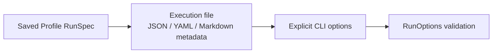
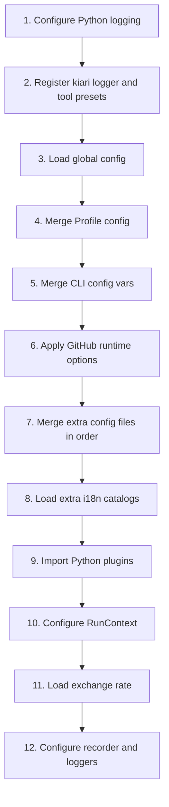
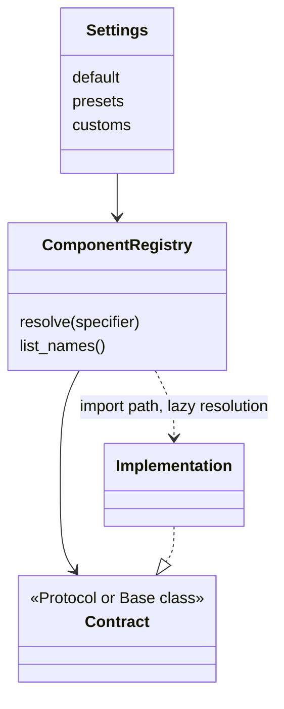

# Runtime, Configuration, and Extensibility

この文書は、kiari が実行設定と component 設定をどのように組み立て、実装を差し替えるかを説明します。全体像は [kiari Architecture](../../ARCHITECTURE.md) を参照してください。

## Two Configuration Planes

kiari の設定は、用途の異なる 2 つの面に分かれます。

### Run Configuration

`RunSpec` は、agent を今回どう実行するかを表す辞書です。Profile に保存でき、最終的に `RunOptions` で検証されます。

主な領域は History、Agent、Tool、Workflow、Prompt、Chat、observability、RunContext、GitHub、追加 config/plugin、各実行モードです。

たとえば `chat_model`、`tools`、`max_iterations`、`history_repository`、`watchers`、`interval` は Run configuration に属します。

### Component Configuration

component configuration は、名前からどの Python 実装を解決するか、その実装をどの設定で生成するかを決めます。各 component family は Pydantic Settings と `SettingsManager` を持ち、一般に次を公開します。

- `default`: specifier が省略されたときに使う名前または specifier
- `presets`: 組み込み名から import path への対応
- `customs`: ユーザーが追加する名前から import path への対応
- 実装固有の接続先、credential、挙動設定

Run configuration が `watch_handler: slack` と選択し、component configuration が `slack` をどの class へ解決するかを定義する、という関係です。

## RunSpec Composition

CLI が実行に使う `RunSpec` の優先順位は、弱いものから強いものへ次の順です。

つまり、同じ key は execution file が保存済み Profile 値を上書きし、明示的な CLI option が execution file を上書きします。値が指定されなかった CLI option は合成対象から除かれるため、保存値を意図せず消しません。

`--set` / `--reset` に対応する save mode は、合成した `RunSpec` を Profile へ保存します。`reset` の場合は既存 RunSpec を先に読み込みません。

Markdown execution file は front matter を RunSpec として扱い、本文を mode の request text として分離できます。batch/console の位置引数、添付、stdin も同様に一時入力へ分離されるため、Profile に会話本文が混入しません。

## Profile Storage

`ProfileStore` は次を管理します。

- 現在選択中の Profile 名
- Profile の一覧と metadata
- Profile ごとの RunSpec
- Profile ごとの component config

ファイル位置の決定は `kiari/core/paths/` に集約されています。Profile が明示されなければ current Profile を使い、存在しない Profile 名を参照した場合も空の Profile として扱える設計です。

RunSpec は「実行の選択」、Profile config は「registry や provider の構成」です。同じ Profile directory に置かれますが、ロード先と役割は別です。

## Runtime Bootstrap Order

`kiari/core/runtime/_helpers/setup_runtime.py` が、各 mode の開始前に process 内設定を組み立てます。

後から merge される明示設定ほど、同じ設定 key に対して強くなります。追加 config のファイル同士は `RunOptions.configs` の解決順にロードされます。

Plugin は component config と追加 i18n がロードされた後に import されます。このため plugin 自身の import 時初期化は、それまでに組み立てられた設定を参照できます。一方、RunContext や logger implementation の最終選択は plugin import 後に行われるため、plugin が registry/settings を拡張した結果を今回の実行に反映できます。

## From RunOptions to Agent Options

`create_agi_options()` は `RunOptions` を `kiarina` が理解する option 群へ変換します。

| RunOptions area | kiarina option |
| --- | --- |
| agent, iteration limits, stop conditions | `AgentOptions` |
| tools, pre/post hooks | `ToolOptions` |
| workflow | `WorkflowOptions` |
| prompt, prompt limits, system messages | `PromptOptions` |
| chat model, tool choice, streaming | `ChatOptions` |

system message を直接指定した場合は `structured` prompt を registry から構築します。明示 `prompt` と `system_messages` は同時に指定できません。

各 Handler は、この option 群に History、RunContext、cost recorder と mode 固有状態を加えて Session を作ります。Session の `as_run_agent_kwargs()` が `run_agent()` 境界の adapter です。

## Component Registry Pattern

差し替え可能な component は、次の形を共有します。

代表的な component family は次のとおりです。

| Family | Contract location | Built-in implementations |
| --- | --- | --- |
| BatchHandler | `kiari/cli/batch/batch_handler` | vanilla |
| ConsoleHandler | `kiari/cli/console/console_handler` | vanilla |
| WatchHandler | `kiari/cli/watch/watch_handler` | vanilla, Slack |
| ScheduleHandler | `kiari/cli/schedule/schedule_handler` | vanilla |
| FastAPIHandler | `kiari/fastapi/fastapi_handler` | vanilla |
| Authenticator | `kiari/fastapi/authenticator` | none, bearer |
| StreamlitHandler | `kiari/streamlit/streamlit_handler` | vanilla |
| StreamlitAuthenticator | `kiari/streamlit/authenticator` | browser-session, OIDC |
| Watcher | `kiari/lib/watcher` | file, Pub/Sub, RTDB, Slack |
| Web | `kiari/lib/web` | mock, kiapi |
| HistoryRepository | `kiari/lib/history_repository` | null, in-memory, local, GCS |
| Finalizer | `kiari/core/finalizer` | null, subprocess |
| ExtensionCommand | `kiari/cli/ext/extension_command` | config/plugin から追加 |
| Tool | `kiarina.agi.tool` | kiari が subprocess、GUI、file tools などを preset 登録 |

Registry は component name を実装へ解決し、factory wrapper が生成後の instance に解決名を設定します。呼び出し側は class ではなく specifier を受け取るため、組み込みと custom 実装を同じ経路で扱えます。

FastAPI の Handler と Authenticator もこの pattern に従います。CLI で確定した RunOptions は
startup payload で worker に渡されますが、component config は worker の `setup_runtime()` が
global/Profile/追加 config から通常どおりロードします。これにより、実行選択の snapshot と
component 実装設定を混同しません。

標準 FastAPIHandler が request body の `config` から上書きを許すのは、History Repository、
History、Agent、Tool、Workflow、Prompt、Chat、Cost Recorder の request 実行中に意味を持つ
項目だけです。process 全体の初期化項目、RunContext、FastAPI/他 mode の項目は拒否します。
custom Handler は request 用 RunOptions の構築 hook を override して独自 policy を実装できます。

StreamlitHandler と StreamlitAuthenticator も同じ registry pattern に従います。Streamlit の
RunOptions は startup payload に固定し、ブラウザ session から変更できるのは agent engine の
session-local option だけです。Authenticator は browser session または OIDC identity を共通型へ
正規化し、agent 一覧と History へのユーザー境界を提供します。

多くの specifier は `name?key=value` 形式で factory 引数も表現できます。実装固有の値は共通 `RunOptions` を増やす前に、component specifier または component settings に置けるかを検討してください。

## Built-In Registration

一部の component は package の settings に最初から preset を持ちます。kiari が `kiarina` の extension point へ提供する component は、`setup_runtime()` が preset を追加します。

現在 runtime で明示登録するものは次のとおりです。

- default cost logger
- default chat logger
- default tool logger
- subprocess、change directory、Chrome Bridge、GUI、Web search/fetch、image/video generation、audio/image/PDF/text/video file tools

この登録は plugin のロードより前に行われるため、追加 config や plugin は組み込み preset を参照または上書きできます。

画像生成は `image_generate` という Tool preset として登録されます。生成に使用するモデルと provider は kiari 固有の RunOptions ではなく、`kiarina.agi.image_generation_model` と関連 provider の component settings で構成します。

## Python Plugins

`RunOptions.plugins` は file specifier の一覧です。`file_resolver` で解決された `.py` ファイルを `load_plugin()` が現在の process に import します。

module 名は解決済み絶対パスの SHA-256 hash から作られ、同じパスは 1 process で 1 回だけロードされます。Plugin は通常、import 時に SettingsManager の custom import path、kiarina の registry、i18n などを構成します。

Plugin の設計上の注意点は次のとおりです。

- import は任意コード実行であり、信頼できるファイルだけを指定する
- import 時副作用は idempotent にする。同じ path は二重ロードされないが、別 path や別 process では再実行される
- optional dependency の `ImportError` は不足 package の案内を表示したうえで再送出される
- process-wide settings を変更するため、複数 Profile を同一 process で順次初期化する用途では状態の残存を考慮する
- mode 固有 request data ではなく、component の登録と構成に利用する

## History Setup and Persistence

Session 作成時の `setup_history()` は次の順で History を決めます。

1. `no_load` なら、指定された initial events、files、tool infos から新規作成する。
2. それ以外は選択された HistoryRepository から RunContext に対応する History を読む。
3. 読み込めなければ新規作成する。
4. 再開時、今回の tool 一覧にない active tool info を原則 disabled にする。
5. 今回指定された tool のうち History にない tool info を追加する。

Handler は non-transient Event を受けるたびに、`no_save` でなければ History を保存します。既定 repository は `null` なので、永続化が必要な実行では `local` などを明示的に選ぶ必要があります。

RunContext の organization/user/agent 識別子は repository の履歴分離にも関係します。外部チャネル向け Handler を追加する場合は、Slack Handler が channel/thread を識別子へ写像している実装を参考にしてください。

## Finalizers and Ownership

Finalizer は process-level resource の終了処理です。既定の `RunOptions.finalizers` は subprocess を含み、mode operation の成否に関係なく最後に実行されます。Chrome Bridge SDK の exclusive session は `chrome` tool の action 内で取得・解放し、共有 managed server とユーザーの Chrome は kiari が所有しないため finalizer の対象にしません。詳しい境界は [Chrome Tool and Chrome Bridge](chrome-tool-and-bridge.md) を参照してください。

所有権は次の基準で決めます。

- 1 request または 1 Session の resource: Handler context の `finally`
- process 内で複数 Session が共有する resource: Finalizer
- `async with` で開始した watcher/audio/client: 開始した scope で終了

新しい共有 resource を導入した場合、正常終了だけでなく例外と graceful shutdown の両方から cleanup されることを確認してください。

## Adding a Replaceable Component

既存 component family を最も近い例として、次の順で追加します。

1. Protocol または base class と、公開する name/specifier 型を定義する。
2. Pydantic Settings に `default`、`presets`、`customs` を必要に応じて定義する。
3. `ComponentRegistry` を作り、factory wrapper で instance の name を設定する。
4. 組み込み実装を `kiari/impl/<family>_impl/<name>/` に置く。
5. package `__init__.py` から意図した公開 API だけを export する。
6. 実装ツリーと同じ位置関係で tests を追加する。
7. RunOptions または runtime bootstrap から選択できるようにする。
8. この文書の component table と、必要なら [Execution Modes](execution-modes.md) を更新する。

共通 option を増やすのは、その値が複数実装の契約に本当に属する場合に限ります。1 実装だけが使う接続情報や挙動は、実装固有 Settings または specifier の引数に置きます。

## Security and Operational Notes

- GitHub file resolver の trust verification と Python plugin の信頼は別の境界である。
- `github_skip_trust_verification` はリモート入力の安全性を下げるため、既定動作として有効化しない。
- plugin、custom import path、extension command は process 内コード実行権限を持つ。
- subprocess、GUI、file edit tool はホストへ副作用を与える。tool の active/inactive/disabled 状態と Profile 設定を確認する。
- credential は RunSpec や execution Markdown に埋め込まず、各 Settings の environment variable または provider が想定する安全な保存先を使う。

設定や拡張機構を変更したときは、Profile 保存値だけでなく、global/Profile config、追加 config、plugin import 後の最終解決結果までをテストしてください。
