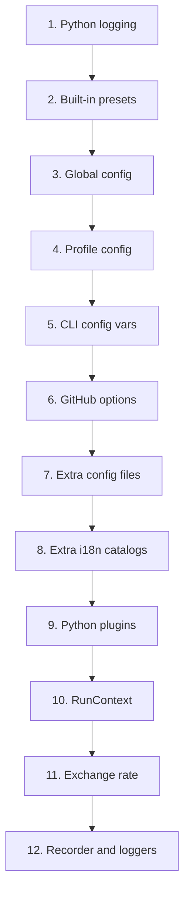
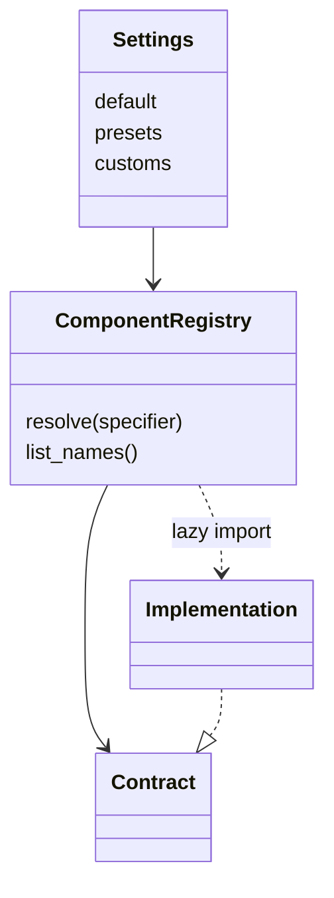

# Runtime, Configuration, and Extensibility

This document describes how kiari composes execution settings, configures components, and
replaces implementations. See [kiari Architecture](../../ARCHITECTURE.md).

## Two Configuration Planes

### Run Configuration

`RunSpec` describes one agent run and is validated as `RunOptions`. It selects history,
agents, tools, workflows, prompts, chat models, observation, context, GitHub behavior,
plugins, and mode options.

### Component Configuration

Component configuration maps names to Python implementations and configures their
construction. A component family commonly exposes:

- `default`: selected name when no specifier is provided
- `presets`: built-in names mapped to import paths
- `customs`: user-defined names mapped to import paths
- implementation-specific connection, credential, and behavior settings

Run configuration may select `watch_handler: slack`; component configuration defines
what `slack` resolves to.

## RunSpec Composition

From lowest to highest precedence:

```text
saved profile → execution file → explicit CLI options → RunOptions validation
```

Unspecified CLI values are omitted so they do not erase stored values. `--set` and
`--reset` save the composed spec; reset skips the existing profile spec. Markdown front
matter supplies settings while its body remains request text. Positional text,
attachments, and stdin are also request-only values.

## Profile Storage

`ProfileStore` manages the current profile, the profile index and metadata, each
profile's `RunSpec`, and component configuration.

kiari always uses `~/.kiari`, split into `config/`, `data/`, and `cache/`.
`setup_app()` sets the kiarina user-directory override for CLI, FastAPI, and Streamlit.
Path decisions remain centralized under `kiari/core/paths/`.

A `RunSpec` selects a run; profile config defines registries and providers. They share a
profile directory but load into different systems.

## Runtime Bootstrap Order



Later explicit settings override earlier values. Plugins load after component config and
i18n, but before final context and logger resolution, so import-time registrations can
affect the current run.

## From RunOptions to Agent Options

`create_agi_options()` maps run settings to `AgentOptions`, `ToolOptions`,
`WorkflowOptions`, `PromptOptions`, and `ChatOptions`. Explicit system messages create
a structured prompt and cannot be combined with an explicit prompt.

Handlers add history, context, recorder, and mode state. Session
`as_run_agent_kwargs()` methods form the adapter to `run_agent()`.

## Component Registry Pattern



Major families include mode handlers, FastAPI and Streamlit authenticators, watchers, web
backends, history repositories, finalizers, extension commands, and tools. A registry
resolves a name or import path; factory wrappers attach the resolved name to instances.

FastAPI request overrides are limited to request-scoped history, agent, tool, workflow,
prompt, chat, and cost settings. Process initialization, context, server, and other mode
settings are rejected. Streamlit browser overrides are likewise limited to session-local
agent options.

Many specifiers accept `name?key=value` factory arguments. Prefer component-specific
settings or specifier arguments over adding fields to shared `RunOptions`.

## Built-In Registration

`setup_runtime()` registers kiari's default cost, chat, and tool loggers and its built-in
tools before loading plugins. Tools include subprocess, directory, Chrome, GUI, web,
media-generation, and file operations.

Media model and provider selection remains in kiarina component settings rather than
kiari-specific run options.

## Python Plugins

`RunOptions.plugins` contains file specifiers. Resolved Python files are imported into
the current process. Module names derive from a SHA-256 hash of the absolute path, and the
same path loads only once per process.

- Plugins execute arbitrary code and must be trusted.
- Import-time effects should be idempotent across paths and processes.
- Missing optional dependencies should be reported and re-raised.
- Process-wide settings may survive sequential profile initialization.
- Plugins should register components and configuration, not request data.

## History Setup and Persistence

`setup_history()` selects history in this order:

1. If `no_load`, build a new history from initial events, files, and tools.
2. Otherwise load by `RunContext` from the selected repository.
3. Create a new history when no stored value exists.
4. Disable previously active tools absent from the current tool set.
5. Add newly selected tools missing from history.

Handlers save after non-transient events unless `no_save`. The default repository is
`null`, so persistent runs must select a repository such as `local`.

Context organization, user, and agent identifiers define repository isolation. External
channel handlers must map remote identity carefully.

## Finalizers and Ownership

Finalizers clean up process-level resources regardless of mode success. The default set
includes subprocess cleanup. Chrome actions own and release their leases; kiari does not
own the managed server or the user's Chrome.

- Request or session resource: handler `finally`
- Resource shared across sessions: finalizer
- Resource opened with `async with`: the opening scope

Test cleanup after success, exceptions, and graceful shutdown.

## Adding a Replaceable Component

1. Define a protocol or base class and public specifier types.
2. Define Pydantic settings with defaults, presets, and customs as needed.
3. Create a `ComponentRegistry` and a factory wrapper.
4. Put built-ins under `kiari/impl/<family>_impl/<name>/`.
5. Export only intended APIs from `__init__.py`.
6. Mirror the implementation location in tests.
7. Expose selection through run options or bootstrap.
8. Update this document and [Execution Modes](execution-modes.md) when applicable.

Only add a common option when it belongs to the contract of multiple implementations.
Keep one-implementation connection and behavior settings local to that implementation.

## Security and Operations

- GitHub trust verification and plugin trust are separate boundaries.
- Do not enable `github_skip_trust_verification` by default.
- Plugins, custom imports, and extension commands execute in-process code.
- Subprocess, GUI, and file-edit tools have host side effects.
- Keep credentials out of `RunSpec` and execution Markdown; use supported environment or
  provider storage.

Tests must cover the final resolution after global config, profile config, extra config,
and plugin imports—not only stored profile values.
